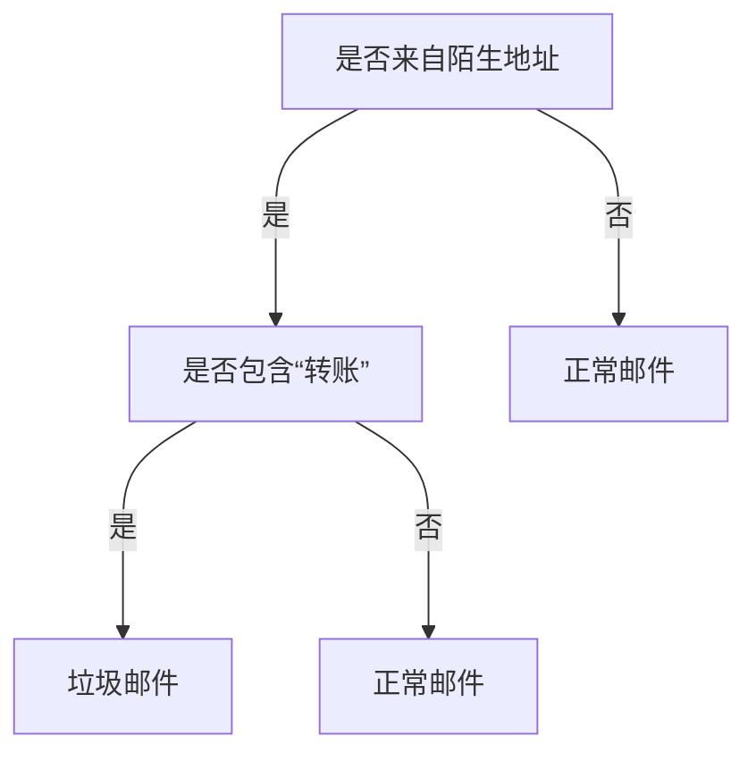

用决策树进行决策，决策在生活中常是一个离散的量，一个常见的例子：当价格上升时，卖掉商品；
决策还需要条件，从上面的例子可以看出
决策树会有点像人类的决策过程，比如在某某情况下我要怎么做
比如说邮件分类



#### Definition

叶子节点：决策、分类类别（分类问题），也可以是预测值比如实数（可以用于回归问题）
非叶子节点：关于一个特征的条件，对于数值型特征，一般用阈值（不等式）来作为判断条件，对于离散型特征，不同的取值作为判断条件


#### Split

> [!question]
> 决策树的构建似乎有很多种方式，怎么安排条件的先后顺序，或许会影响决策树的效率或者预测效果
> 
> 比如下面这个：
> ```mermaid
> graph TD
> A[金主赞助] --->|全额| B[吃]
> A[金主赞助] --->|部分| C[饿不饿]
> A[金主赞助] --->|没有| D[不吃]  
> C --->|不饿| E[不吃]
> C --->|饿| F[什么菜]
> F --->|法国菜| G[吃]
> F --->|意大利菜| H[不吃]
> F --->|泰国菜| I[周末吗]
> F --->|汉堡包| J[吃]
> I --->|是| K[吃]
> I --->|不是| L[不吃]
> style B fill:green
> style J fill:green
> style K fill:green
> style G fill:green
> style D fill:red
> style E fill:red
> style H fill:red
> style L fill:red
> ```
> 如果这里我们先考察吃什么菜的特征，那在其子结点中要重复判断金主赞助
> 
> 怎么来确定考察特征的顺序最好？怎么分割节点最好？
> 
> ![[DT1.png]]
> 
> 从直觉上来说，似乎每一个节点下面越纯净越好，如果一种分割使得下一步可以直接决策，那当然是非常好的
> 
> 这会有点像使得分开的节点不那么“混乱”，不是吗

欸，提到“混乱”，是不是可以想到熵的办法

##### Entropy

给一个父节点 $u$ (一个分割)，有 $m$ 个儿子，第 $i$ 个是 $v_i$ , 针对一个预测 $k$ 

$P_{k,i} = p(k \;{\rm under} \;v_i|k \;{\rm under}\; u)$

$$
E(u) = -\sum_{i=1}^m  P_{k,i}\log_2 P_{k,i}
$$


##### Misclassification Error

或者说，我们可以用准确率来评估这一次分割的好坏

$$
E(u) = 1 - \max_k P_k
$$

##### GINI Index

$$
{\rm GINI}(u) = 1 - \sum_k P_k^2
$$


