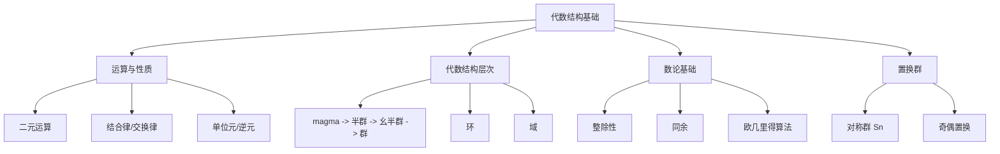
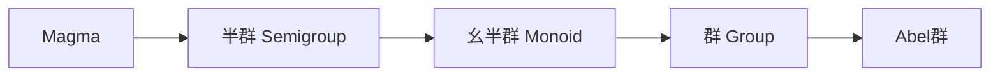

---

title: 抽象代数 L1 | 代数结构基础

draft: false

tags:

  - 抽象代数

  - 基础概念

  - 群论

---

> [!note] 本章概述
> 本章介绍抽象代数的基本概念，为整个课程奠定基础。我们将了解什么是代数结构、运算的性质、常见的代数系统（群、环、域）以及数论基础。抽象代数是现代数学的基础，也是密码学、编码理论等领域的重要工具。

## 章节脉络

---

## 1. 抽象代数导论

### 什么是抽象代数？

**抽象代数**研究代数结构的本质——即集合上运算的性质。它不关心具体对象的"含义"，而是关注**运算规律**本身。

> [!tip] 抽象的力量
> 抽象让我们看到不同数学对象背后的共同结构：整数加法、矩阵乘法、函数复合、平面旋转...它们都遵循"群"的规律！这就是抽象的威力——一次研究，多处应用。

### 运算的本质

**运算**是将多个元素"组合"产生新元素的规则：

| 运算类型 | 定义 | 示例 |
|---------|------|------|
| **一元运算** | $f: S \to S$ | 取相反数、转置 |
| **二元运算** | $f: S \times S \to S$ | 加法、乘法、复合 |
| **n元运算** | $f: S^n \to S$ | 行列式 |

---

## 2. 二元运算的性质

### 2.1 结合律 Associativity

> [!abstract] 定义
> $$(a \circ b) \circ c = a \circ (b \circ c)$$

- **意义**：运算顺序不影响结果，可以省略括号
- **例子**：整数加法、乘法、矩阵乘法、函数复合

> [!caution] 注意
> 减法、除法**不满足**结合律：
> - $(5-3)-1 \neq 5-(3-1)$
> - $(12\div4)\div2 \neq 12\div(4\div2)$

### 2.2 交换律 Commutativity

> [!abstract] 定义
> $$a \circ b = b \circ a$$

- **例子**：整数加法、乘法
- **反例**：矩阵乘法、函数复合、群运算

### 2.3 单位元 Identity Element

> [!abstract] 定义
> 存在元素 $e \in S$，使得对所有 $a \in S$：
> $$a \circ e = e \circ a = a$$

- **左单位元**：$e \circ a = a$
- **右单位元**：$a \circ e = a$
- 若同时存在，则必相等

### 2.4 逆元 Inverse Element

> [!abstract] 定义
> 对于 $a \in S$，若存在 $b \in S$ 使得：
> $$a \circ b = b \circ a = e$$
> 则称 $b$ 为 $a$ 的逆元，记作 $a^{-1}$

- **注意**：逆元是相对于特定单位元定义的

---

## 3. 代数结构的层次

### 结构层级

| 结构 | 定义 | 示例 |
|------|------|------|
| **Magma（亚群）** | 集合 + 二元运算 | 整数减法 |
| **半群（Semigroup）** | 闭合 + 结合律 | $(\mathbb{N}, \max)$ |
| **幺半群（Monoid）** | 半群 + 单位元 | $(\mathbb{N}, \max, 0)$ |
| **群（Group）** | 幺半群 + 逆元 | $(\mathbb{Z}, +, 0)$ |
| **Abel群** | 交换群 | $(\mathbb{Z}, +)$ |

> [!important] 群是核心
> **群**是抽象代数中最重要的结构：闭合、结合、有单位元、每个元素有逆元。群论是整个抽象代数的基础。

### 环 Ring

> [!abstract] 定义
> $(R, +, \cdot)$ 满足：
> 1. $(R, +)$ 是 Abel 群
> 2. $(R, \cdot)$ 是半群
> 3. 乘法对加法分配律：$a \cdot (b + c) = a \cdot b + a \cdot c$

- **例子**：整数 $\mathbb{Z}$、多项式环 $R[x]$、矩阵环 $M_n(R)$

### 域 Field

> [!abstract] 定义
> $(F, +, \cdot)$ 满足：
> 1. $(F, +)$ 是 Abel 群
> 2. $(F \setminus \{0\}, \cdot)$ 是 Abel 群
> 3. 乘法对加法分配律

- **例子**：有理数 $\mathbb{Q}$、实数 $\mathbb{R}$、复数 $\mathbb{C}$、有限域 $\mathbb{F}_p$

> [!tip] 域 vs 环
> 域要求**所有非零元素**都有乘法逆元。域是能做"除法"的环。

---

## 4. Cayley 表格

**Cayley 表格**是描述有限代数结构的表格：

| $\cdot$ | $e$ | $a$ | $b$ |
|---------|-----|-----|-----|
| $e$     | $e$ | $a$ | $b$ |
| $a$     | $a$ | $b$ | $e$ |
| $b$     | $b$ | $e$ | $a$ |

- 行 = 左操作数，列 = 右操作数
- 快速检查：单位元（某行某列等于自身）、逆元（某行某列等于单位元）

> [!example] Klein 四元群 $V_4$
> Klein 四元群是阶为 4 的阿贝尔群，每个元素的阶都是 2。

---

## 5. 数论基础

### 5.1 整除性

> [!abstract] 定义
> $a \mid b$（$a$ 整除 $b$）当且仅当存在整数 $k$ 使得 $b = ak$

**性质**：
- 若 $a \mid b$ 且 $b \mid c$，则 $a \mid c$（传递性）
- 若 $a \mid b$ 且 $a \mid c$，则 $a \mid (b \pm c)$

### 5.2 同余 Modulo

> [!abstract] 定义
> $a \equiv b \pmod n$ 当且仅当 $n \mid (a - b)$

**同余类**：
$$\mathbb{Z}_n = \{[0], [1], ..., [n-1]\}$$

> [!info] $\mathbb{Z}_n$ 的结构
> - $(\mathbb{Z}_n, +)$ 是阿贝尔群
> - $(\mathbb{Z}_n, \cdot)$ 是幺半群
> - 当 $n$ 为素数时，$(\mathbb{Z}_n \setminus \{0\}, \cdot)$ 是群（构成域）

### 5.3 欧几里得算法

> [!algorithm] 求最大公约数
> $$\gcd(a, b) = \gcd(b, a \bmod b)$$

**扩展欧几里得算法**：求贝祖系数 $x, y$ 使得：
$$ax + by = \gcd(a, b)$$

> [!example] 应用：求模逆元
> 若 $\gcd(a, n) = 1$，则 $a$ 在 $\mathbb{Z}_n$ 中存在逆元，可用扩展欧几里得算法求 $a^{-1} \pmod n$。

---

## 6. 复数作为代数系统

### 复数基础

$$i^2 = -1, \quad z = a + bi$$

**运算**：
- 加法：$(a+bi) + (c+di) = (a+c) + (b+d)i$
- 乘法：$(a+bi)(c+di) = (ac-bd) + (ad+bc)i$

> [!important] 共轭与模
> - 共轭：$\overline{z} = a - bi$
> - 模：$|z| = \sqrt{z \cdot \overline{z}} = \sqrt{a^2 + b^2}$
> - 复数乘法保持模：$|z_1 z_2| = |z_1| \cdot |z_2|$

---

## 7. 置换群 Permutation Groups

### 7.1 对称群 $S_n$

> [!abstract] 定义
> **对称群** $S_n$ 是 $n$ 个元素的**所有置换**组成的群

- **阶**：$|S_n| = n!$
- **运算**：置换的复合（从右到左）

### 7.2 置换的表示

**两行表示**：
$$\begin{pmatrix} 1 & 2 & 3 & 4 \\ 2 & 4 & 1 & 3 \end{pmatrix} = (1\ 2\ 4\ 3)(3)$$

**循环表示**：
$$\sigma = (1\ 2\ 4\ 3)$$

- **不相交循环可交换**

### 7.3 奇偶置换

> [!abstract] 定义
> - **偶置换**：可分解为偶数个对换
> - **奇置换**：可分解为奇数个对换

**重要性质**：
- 偶置换的乘积是偶置换
- 奇置换的乘积是奇置换
- 偶置换构成**交错群** $A_n$

> [!theorem] $S_n$ 的子群结构
> - $A_n$ 是 $S_n$ 的指数为 2 的子群
> - $|A_n| = n!/2$

---

## 本章小结

> [!summary]
> 1. **二元运算**：结合律、交换律、单位元、逆元是核心性质
> 2. **代数结构层次**：Magma -> 半群 -> 幺半群 -> 群 -> Abel群
> 3. **群**：闭合、结合、有单位元、每个元素有逆元
> 4. **环与域**：环有加法和乘法，域是可做除法的环
> 5. **数论**：整除性、同余、欧几里得算法是数论基础
> 6. **置换群**：$S_n$ 是 $n$ 阶对称群，$A_n$ 是交错群

---

## 思考题

1. **判断题**：矩阵乘法满足交换律。

   > [!answer]
   > **答案：错误**。一般矩阵乘法不满足交换律：$AB \neq BA$。

2. **选择题**：以下哪个不是群？
   - A. $(\mathbb{Z}, +)$
   - B. $(\mathbb{Z}, \times)$
   - C. $(\mathbb{Q} \setminus \{0\}, \times)$
   - D. $(\mathbb{Z}_5 \setminus \{0\}, \times)$

   > [!answer]
   > **答案：B**。$(\mathbb{Z}, \times)$ 不是群，因为整数乘法中只有 $1$ 和 $-1$ 有逆元（其他整数的乘法逆元不是整数）。

3. **问答题**：解释为什么 $(\mathbb{Z}_6 \setminus \{0\}, \times)$ 不是群。

   > [!answer]
   > **答案要点**：
   > - 考虑元素 $[2]$：在 $\mathbb{Z}_6$ 中，$2 \times 3 = 0 \pmod 6$，找不到 $2$ 的乘法逆元
   > - 一般来说，$\mathbb{Z}_n \setminus \{0\}$ 是群当且仅当 $n$ 是素数（此时构成有限域）

---

## 发散拓展

### 抽象代数的实际应用

1. **密码学**
   - RSA 加密：基于大整数分解的困难性
   - 椭圆曲线密码学：基于椭圆曲线上的群结构
   - [RSA 算法原理](https://en.wikipedia.org/wiki/RSA_(cryptosystem))

2. **编码理论**
   - 线性码：基于域上向量空间
   - 伽罗瓦域 $\mathbb{F}_{2^m}$：用于 Reed-Solomon 码
   - [纠错码入门](https://en.wikipedia.org/wiki/Error_detection_and_correction)

3. **物理学**
   - 晶体对称群：描述晶体的空间对称性
   - 李群：连续变换群，用于粒子物理
   - [晶体学点群](https://en.wikipedia.org/wiki/Crystal_system)

4. **化学**
   - 分子对称性：分子点群用于光谱分析
   - 群论在分子振动中的应用

> [!info] 延伸学习
> - 深入学习：参考 Dummit & Foote《抽象代数》
> - 实践工具：GAP（计算群论软件）
> - 后续内容：[[抽象代数 L2 | 群论基础]] 将深入学习群论的核心内容
