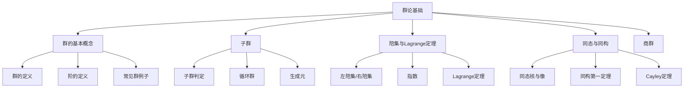

---

title: 抽象代数 L2 | 群论基础

draft: false

tags:

  - 抽象代数

  - 群论

  - 子群

  - 同构

---

> [!note] 本章概述
> 本章深入学习群论的核心内容：群的定义与例子、子群与陪集、Lagrange定理、同态与同构、商群。群论是抽象代数最核心的主题，它揭示了对称性的数学本质。

## 章节脉络

---

## 1. 群的基本概念

### 1.1 群的定义

> [!abstract] 群
> 设 $G$ 是非空集合，$\cdot$ 是 $G$ 上的二元运算。若满足：
> 1. **闭合性**：$\forall a,b \in G, ab \in G$
> 2. **结合律**：$\forall a,b,c \in G, (ab)c = a(bc)$
> 3. **单位元**：$\exists e \in G, \forall a \in G, ea = ae = a$
> 4. **逆元**：$\forall a \in G, \exists a^{-1} \in G, aa^{-1} = a^{-1}a = e$
>
> 则称 $(G, \cdot)$ 为**群**。

> [!tip] 群的本质
> 群是描述"可逆变换"的数学结构。从旋转到置换，从整数加法到矩阵乘法——凡是可以"做"、可以"undo"的操作，都构成群。

### 1.2 群的阶 Order

> [!abstract] 定义
> - **群的阶**：$|G|$ = 群中元素的个数（有限/无限群）
> - **元素的阶**：$|a| = \min\{n > 0 \mid a^n = e\}$，若不存在则阶为无限

**重要性质**：
- $a^n = e \Rightarrow |a| \mid n$
- $|a| = |a^{-1}|$

### 1.3 常见群例子

| 群 | 记号 | 阶 | 说明 |
|----|------|-----|------|
| 整数加法群 | $(\mathbb{Z}, +)$ | 无限 | 单位元 0，逆元 $-a$ |
| 模 $n$ 整数加法群 | $(\mathbb{Z}_n, +)$ | $n$ | 循环群 |
| 对称群 | $S_n$ | $n!$ | $n$ 元素的所有置换 |
| 交错群 | $A_n$ | $n!/2$ | 偶置换构成的子群 |
| 二面体群 | $D_{2n}$ | $2n$ | 正 $n$ 边形的对称群 |
| 一般线性群 | $GL(n, \mathbb{R})$ | 无限 | 可逆 $n \times n$ 矩阵 |
| 特殊线性群 | $SL(n, \mathbb{R})$ | 无限 | 行列式为 1 的矩阵 |
| 循环群 | $C_n$ | $n$ | 由单个元素生成 |

> [!example] 二面体群 $D_{2n}$
> 正 $n$ 边形的对称群：
> - $r$：旋转 $360^\circ/n$
> - $s$：反射
> - 关系：$r^n = e, s^2 = e, srs = r^{-1}$

---

## 2. 子群 Subgroup

### 2.1 子群的定义

> [!abstract] 定义
> $H$ 是 $G$ 的**子群**（记作 $H \leqslant G$）当且仅当：
> 1. $H \neq \emptyset$
> 2. $\forall a,b \in H, ab \in H$（闭合）
> 3. $\forall a \in H, a^{-1} \in H$（逆元）

> [!info] 平凡子群
> 任何群都有两个**平凡子群**：$\{e\}$ 和 $G$ 本身。

### 2.2 子群判定

> [!theorem] 有限子群判定
> 对于有限群 $G$，若 $H$ 是非空子集且对运算闭合，则 $H$ 是子群。

> [!theorem] 一步子群判定
> $H \leqslant G \Leftrightarrow \forall a,b \in H, ab^{-1} \in H$

### 2.3 循环群 Cyclic Group

> [!abstract] 定义
> 若存在 $g \in G$ 使得 $G = \langle g \rangle = \{g^n \mid n \in \mathbb{Z}\}$，则称 $G$ 是**循环群**，$g$ 是**生成元**。

> [!important] 循环群的结构
> - 无限循环群 $\cong (\mathbb{Z}, +)$
> - $n$ 阶循环群 $\cong (\mathbb{Z}_n, +)$
> - 循环群的子群仍是循环群
> - $n$ 阶循环群的子群阶数整除 $n$

> [!example] $\mathbb{Z}_n$ 的生成元
> $\mathbb{Z}_n$ 的生成元是所有与 $n$ 互素的数对应的幂：$\langle k \rangle = \mathbb{Z}_n \Leftrightarrow \gcd(k, n) = 1$
> 生成元个数为 $\phi(n)$（欧拉函数）

---

## 3. 陪集 Cosets

### 3.1 左陪集与右陪集

> [!abstract] 定义
> 给定子群 $H \leqslant G$，$a \in G$：
> - **左陪集**：$aH = \{ah \mid h \in H\}$
> - **右陪集**：$Ha = \{ha \mid h \in H\}$

> [!info] 性质
> - $aH = H \Leftrightarrow a \in H$
> - $aH = bH \Leftrightarrow a^{-1}b \in H$
> - 陪集划分 $G$

### 3.2 指数 Index

> [!abstract] 定义
> 子群 $H$ 在 $G$ 中的**指数**：$|G:H| = [G:H]$ = 陪集的个数

$$[G:H] = \frac{|G|}{|H|}$$

### 3.3 Lagrange 定理

> [!important] 核心定理
> 若 $G$ 是有限群，$H \leqslant G$，则：
> $$|G| = |H| \cdot [G:H]$$

**推论**：
- 子群的阶整除群的阶
- 元素的阶整除群的阶
- $a^{|G|} = e$（费马小定理的群论推广）

> [!proof]- 证明思路
> 陪集将群划分为不相交的子集，每个陪集大小等于 $|H|$，因此 $|G| = [G:H] \cdot |H|$。

---

## 4. 同态与同构 Homomorphism & Isomorphism

### 4.1 同态

> [!abstract] 定义
> 映射 $\phi: G \to H$ 是**群同态**当且仅当：
> $$\phi(ab) = \phi(a)\phi(b), \quad \forall a,b \in G$$

**分类**：
- **单同态**：$\phi$ 为单射
- **满同态**：$\phi$ 为满射
- **同构**：$\phi$ 为双射（记作 $G \cong H$）

### 4.2 同态的基本性质

> [!theorem] 核与像
> - **核**：$\ker\phi = \{g \in G \mid \phi(g) = e_H\}$，是 $G$ 的正规子群
> - **像**：$\text{Im}\phi = \phi(G)$，是 $H$ 的子群
> - **同态基本定理**：$G/\ker\phi \cong \text{Im}\phi$

### 4.3 Cayley 定理

> [!important] 定理
> 任何群都同构于某个置换群的子群（作为变换群）。

> [!proof]- 证明思路
> 考虑左正则作用：$L_g: G \to G, L_g(x) = gx$。这给出同态 $\lambda: G \to S_G$，核是 $\{e\}$，故 $G \cong \text{Im}\lambda$。

---

## 5. 正规子群与商群

### 5.1 正规子群 Normal Subgroup

> [!abstract] 定义
> $N \trianglelefteq G$（$N$ 是 $G$ 的正规子群）当且仅当：
> $$\forall g \in G, \forall n \in N: gng^{-1} \in N$$

- 等价条件：$gN = Ng, \quad \forall g \in G$
- 正规子群的左右陪集相同

> [!example] 重要例子
> - $A_n \trianglelefteq S_n$（交错群是对称群的正规子群）
> - $SL(n, \mathbb{R}) \trianglelefteq GL(n, \mathbb{R})$
> - $\{e\} \trianglelefteq G$ 和 $G \trianglelefteq G$（平凡正规子群）

### 5.2 商群 Quotient Group

> [!abstract] 定义
> 若 $N \trianglelefteq G$，定义商群：
> $$G/N = \{gN \mid g \in G\}$$
> - 运算：$(aN)(bN) = (ab)N$
> - 阶数：$|G/N| = [G:N]$

> [!important] 同态基本定理
> 若 $\phi: G \to H$ 是满同态，$\ker\phi = N$，则：
> $$G/N \cong H$$

---

## 6. 群的直积 Direct Product

### 6.1 外直积

> [!abstract] 定义
> 群的**直积**：$G \times H = \{(g,h) \mid g \in G, h \in H\}$，运算为分量运算。

**阶数**：$|G \times H| = |G| \cdot |H|$

### 6.2 中国剩余定理的群论版本

> [!theorem] 循环群的直积分解
> 若 $m, n$ 互素，则：
> $$\mathbb{Z}_{mn} \cong \mathbb{Z}_m \times \mathbb{Z}_n$$

> [!important] 有限Abel群分类
> 任何有限阿贝尔群同构于若干循环群的直积：
> $$G \cong \mathbb{Z}_{n_1} \times \mathbb{Z}_{n_2} \times \cdots \times \mathbb{Z}_{n_k}$$
> 其中 $n_1 | n_2 | \cdots | n_k$（不变因子分解）

---

## 本章小结

> [!summary]
> 1. **群**：闭合、结合、有单位元、每个元素有逆元
> 2. **子群**：群的子集构成子群，需满足闭合和逆元条件
> 3. **循环群**：由单个元素生成，同构于 $\mathbb{Z}$ 或 $\mathbb{Z}_n$
> 4. **Lagrange定理**：$|G| = |H| \cdot [G:H]$，子群阶整除群阶
> 5. **同态与同构**：保持运算结构的映射，同构是双射同态
> 6. **正规子群与商群**：正规子群的陪集构成商群
> 7. **Cayley定理**：任何群同构于某个置换群的子群

---

## 思考题

1. **选择题**：以下哪个是 $S_3$ 的子群？
   - A. $\{e, (12)\}$
   - B. $\{e, (123), (132)\}$
   - C. $\{e, (12), (23), (13)\}$
   - D. $\{e\}$

   > [!answer]
   > **答案：B**。$\{e, (123), (132)\} = A_3$，是 $S_3$ 的子群（也是正规子群）。A 不满足闭合性（$(12)(12) = e$ 在集合外），C 有4个元素但 $4 \nmid 6$。

2. **判断题**：若 $a^6 = e$，则 $|a|$ 一定是 6。

   > [!answer]
   > **答案：错误**。$|a|$ 可以是 1、2、3 或 6，只要能整除 6 即可。例如 $|e| = 1$，$|(12)| = 2$，$|(123)| = 3$。

3. **问答题**：证明：若 $H$ 和 $K$ 都是 $G$ 的子群，则 $HK$ 是子群当且仅当 $HK = KH$。

   > [!answer]
   > **答案要点**：
   > - ($\Rightarrow$) 若 $HK$ 是子群，则对任意 $hk \in HK$，$(hk)^{-1} = k^{-1}h^{-1} \in KH$，故 $HK \subseteq KH$；同理 $KH \subseteq HK$，故 $HK = KH$
   > - ($\Leftarrow$) 若 $HK = KH$，取 $h_1k_1, h_2k_2 \in HK$，则 $(h_1k_1)(h_2k_2)^{-1} = h_1k_1k_2^{-1}h_2^{-1} = h_1(k_1k_2^{-1}h_2^{-1})$，由于 $KH = HK$，可写成 $h'h''$ 形式，属于 $HK$，满足子群判定条件

---

## 发散拓展

### 群论的实际应用

1. **晶体学**
   - 230 个空间群描述晶体的对称性
   - 32 个点群描述晶体的宏观对称性
   - [晶体对称群数据库](https://www.cryst.ehu.es/)

2. **密码学**
   - 有限域上的椭圆曲线群
   - 群上的 Diffie-Hellman 密钥交换
   - [椭圆曲线密码学](https://en.wikipedia.org/wiki/Elliptic-curve_cryptography)

3. **量子力学**
   - 对称群在多粒子系统中的应用
   - 旋转群 $SO(3)$ 与自旋
   - [群论与量子力学](https://en.wikipedia.org/wiki/Group_theory_and_quantum_mechanics)

4. **艺术与设计**
   - 装饰图案中的对称群（二维晶体群）
   - 埃舍尔的镶嵌画
   - [17种二维 wallpaper 群](https://en.wikipedia.org/wiki/Wallpaper_group)

> [!info] 延伸学习
> - 深入学习：参考 Artin《代数》
> - 实践工具：GAP、Magma（计算代数系统）
> - 后续内容：[[抽象代数 L3 | 群论进阶]] 将学习置换群、轨道-稳定子定理、Sylow定理等内容
