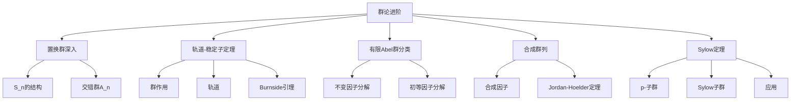

---

title: 抽象代数 L3 | 群论进阶

draft: false

tags:

  - 抽象代数

  - 群论

  - Sylow定理

  - 可解群

---

> [!note] 本章概述
> 本章深入学习群论的高级主题：置换群的深入分析、轨道-稳定子定理、Cayley定理的另一种证明、有限Abel群的分类、合成群列与Jordan-Hölder定理、Sylow定理。Sylow定理是有限群论的核心，揭示了$p$-子群的结构。

## 章节脉络

---

## 1. 置换群深入

### 1.1 对称群 $S_n$ 的结构

$S_n$ 是 $n$ 元素所有置换构成的群，阶为 $n!$。

**置换的类型**：
- **循环**：$\sigma = (a_1 a_2 ... a_k)$，长度为 $k$
- **对换**：长度为 2 的循环 $(ab)$
- **不相交循环**：可交换

**任何置换可唯一分解为不相交循环的乘积**（顺序不重要）。

> [!example] 置换分解
> $$\sigma = \begin{pmatrix} 1 & 2 & 3 & 4 & 5 & 6 \\ 3 & 6 & 1 & 5 & 4 & 2 \end{pmatrix} = (1\ 3)(2\ 6)(4\ 5)$$

### 1.2 交错群 $A_n$

> [!abstract] 定义
> **交错群** $A_n$ 是 $S_n$ 中所有偶置换构成的子群。

**性质**：
- $|A_n| = n!/2$
- $A_n \trianglelefteq S_n$（正规子群）
- $S_n/A_n \cong C_2$

> [!info] $A_n$ 的单性
> 当 $n \geq 5$ 时，$A_n$ 是**单群**——没有非平凡正规子群。这是"五次方程不可根式解"证明的关键。

---

## 2. 群作用与轨道-稳定子定理

### 2.1 群作用

> [!abstract] 定义
> 群 $G$ 在集合 $X$ 上的**作用**是映射：
> $$\cdot: G \times X \to X, \quad (g, x) \mapsto g \cdot x$$
> 满足：
> 1. $e \cdot x = x$
> 2. $(gh) \cdot x = g \cdot (h \cdot x)$

> [!example] 常见群作用
> - **左乘作用**：$L_g(x) = gx$
> - **共轭作用**：$c_g(x) = gxg^{-1}$
> - **置换表示**：$S_n$ 在 $\{1, 2, ..., n\}$ 上的作用

### 2.2 轨道与稳定子

> [!abstract] 定义
> - **轨道**：$G \cdot x = \{g \cdot x \mid g \in G\}$
> - **稳定子**：$G_x = \{g \in G \mid g \cdot x = x\}$

**轨道-稳定子定理**（Orbit-Stabilizer Theorem）：
> [!important] 核心定理
> 若群 $G$ 在有限集合 $X$ 上的作用是忠实的，则：
> $$|G| = |G \cdot x| \cdot |G_x|$$

> [!proof]- 证明思路
> 轨道 $G \cdot x$ 与左陪集空间 $G/G_x$ 之间存在双射：$g \cdot x \leftrightarrow gG_x$。

### 2.3 Burnside 引理

> [!theorem] Burnside 引理
> 群 $G$ 在集合 $X$ 上作用的轨道数为：
> $$|X/G| = \frac{1}{|G|} \sum_{g \in G} |X^g|$$
> 其中 $X^g = \{x \in X \mid g \cdot x = x\}$ 是 $g$ 的不动点集。

> [!example] 应用：着色问题
> 正方形的旋转对称群有 4 个元素，计算有多少种本质不同的着色方案。

---

## 3. Cayley 定理（另一种证明）

### 证明思路

利用左乘作用：$\lambda: G \to S_G$，其中 $\lambda(g)(x) = gx$。

- $\lambda$ 是同态
- $\ker\lambda = \{e\}$（忠实作用）
- $\text{Im}\lambda \leqslant S_G$

因此 $G \cong \text{Im}\lambda$，即 $G$ 同构于某个置换群（$S_G$ 的子群）。

---

## 4. 有限 Abel 群的分类

### 4.1 不变因子分解

> [!important] 基本定理
> 任何有限阿贝尔群 $G$ 同构于循环群的直积：
> $$G \cong \mathbb{Z}_{n_1} \times \mathbb{Z}_{n_2} \times \cdots \times \mathbb{Z}_{n_k}$$
> 其中 $n_1 | n_2 | \cdots | n_k$，$n_i > 1$。

> [!example] 分类举例
> - 15 阶阿贝尔群：$\mathbb{Z}_{15}$ 或 $\mathbb{Z}_3 \times \mathbb{Z}_5$（相同，因为 $3 \nmid 5$）
> - 12 阶阿贝尔群：$\mathbb{Z}_{12}$ 或 $\mathbb{Z}_4 \times \mathbb{Z}_3$ 或 $\mathbb{Z}_2 \times \mathbb{Z}_2 \times \mathbb{Z}_3$

### 4.2 初等因子分解

另一种等价形式：
$$G \cong \mathbb{Z}_{p_1^{e_1}} \times \mathbb{Z}_{p_2^{e_2}} \times \cdots \times \mathbb{Z}_{p_m^{e_m}}$$

其中 $p_i$ 是素数（不必互异）。

> [!info] 两种分解的关系
> - 不变因子：$n_i$ 彼次整除
> - 初等因子：$p^e$ 形式，直观但可能不唯一

---

## 5. 合成群列与 Jordan-Hölder 定理

### 5.1 合成群列

> [!abstract] 定义
> **合成群列**是群的正规子群链：
> $$G = G_0 \rhd G_1 \rhd \cdots \rhd G_k = \{e\}$$
> 使得每个**合成因子** $G_i/G_{i+1}$ 是**单群**。

> [!info] 长度
> 合成群列的长度 $k$ 称为群的**合成长度**。

### 5.2 Jordan-Hölder 定理

> [!important] 定理
> 若群 $G$ 有两个合成群列：
> $$G = G_0 \rhd G_1 \rhd \cdots \rhd G_k = \{e\}$$
> $$G = H_0 \rhd H_1 \rhd \cdots \rhd H_l = \{e\}$$
> 则 $k = l$，且合成因子在重排后同构。

> [!tip] 重要意义
> 这个定理说明：**有限群的基本构建块（合成因子）是唯一确定的**，尽管构建方式可能不同。

### 5.3 可解群 Solvable Group

> [!abstract] 定义
> 群 $G$ 是**可解群**当且仅当存在正规子群链：
> $$G = G_0 \rhd G_1 \rhd \cdots \rhd G_k = \{e\}$$
> 使得每个合成因子 $G_i/G_{i+1}$ 是**阿贝尔群**。

> [!important] 历史背景
> - 可解群与**代数方程根式可解性**密切相关
> - Galois 理论：方程可根式解当且仅当其 Galois 群是可解群
> - 五次方程不可根式解：因为 $S_5$ 不是可解群（$A_5$ 是单群）

> [!example] 可解群例子
> - 所有阿贝尔群
> - $S_3$（合成因子：$S_3/A_3 \cong \mathbb{Z}_2$，$A_3 \cong \mathbb{Z}_3$）
> - $S_4$（可解）
> - $S_5$（不可解）

---

## 6. Sylow 定理

### 6.1 $p$-子群

> [!abstract] 定义
> - **$p$-群**：元素的阶都是 $p$ 的幂
> - **$p$-子群**：子群中所有元素都是 $p$-元
> - **Sylow $p$-子群**：阶为 $p^k$ 的子群，其中 $p^k$ 是 $|G|$ 的最高 $p$ 幂因子

记 $|G| = p^k m$，其中 $p \nmid m$，则 Sylow $p$-子群的阶为 $p^k$。

### 6.2 Sylow 定理（三定理）

> [!theorem] Sylow 第一定理
> 存在 Sylow $p$-子群（存在性）。

> [!theorem] Sylow 第二定理
> 所有 Sylow $p$-子群互相共轭（极大性）。

> [!theorem] Sylow 第三定理
> Sylow $p$-子群的个数 $n_p$ 满足：
> 1. $n_p \equiv 1 \pmod p$
> 2. $n_p \mid m$

### 6.3 应用

> [!example] 有限群的结构
> Sylow 定理用于确定有限群的结构：
> - 证明某些群的存在性
> - 证明某些群是单群（如 $A_5$）
> - 分类小阶群

> [!example] 证明 $A_5$ 是单群
> - $|A_5| = 60 = 2^2 \cdot 3 \cdot 5$
> - Sylow 子群：$n_5 = 1, 6$；若 $n_5 = 6$，则存在 6 个 5 阶子群互相共轭...（矛盾）
> - 证明无正规子群，故为单群

---

## 本章小结

> [!summary]
> 1. **置换群**：$S_n$ 的结构由循环分解刻画，$A_n$ 是偶置换子群，$n \geq 5$ 时 $A_n$ 是单群
> 2. **轨道-稳定子定理**：$|G| = |\text{轨道}| \times |\text{稳定子}|$
> 3. **Burnside 引理**：计数轨道数的工具
> 4. **有限 Abel 群分类**：同构于循环群的直积（不变因子或初等因子形式）
> 5. **合成群列**：Jordan-Hölder 定理保证合成因子的唯一性
> 6. **可解群**：与代数方程根式可解性相关，$S_5$ 不可解导致五次方程无根式解
> 7. **Sylow 定理**：描述 $p$-子群的存在、共轭、数量

---

## 思考题

1. **选择题**：$S_4$ 有多少个 Sylow 3-子群？
   - A. 1
   - B. 2
   - C. 4
   - D. 8

   > [!answer]
   > **答案：C**。$|S_4| = 24 = 2^3 \cdot 3$，$m = 8$，$n_3 \mid 8$ 且 $n_3 \equiv 1 \pmod 3$，故 $n_3 = 1$ 或 $4$，但 Sylow 3-子群是 3 阶循环，不能只有 1 个（否则正规，与 $S_4$ 非单矛盾），故 $n_3 = 4$。

2. **判断题**：所有有限单群都是可解群。

   > [!answer]
   > **答案：错误**。$A_5$ 是有限单群但不可解（$S_5$ 不可解）。可解群的合成因子是阿贝尔群，而单群的合成因子只能是自身（若非平凡），所以不可解的单群存在。

3. **问答题**：解释为什么五次方程 $ax^5 + bx^4 + cx^3 + dx^2 + ex + f = 0$ 没有通用的根式解。

   > [!answer]
   > **答案要点**：
   > - 一般五次方程的 Galois 群是 $S_5$
   > - $S_5$ 不可解（因为 $A_5$ 是单群且 $S_5/A_5 \cong \mathbb{Z}_2$ 不够把 $A_5$ 分解成阿贝尔群链）
   > - 根据 Galois 理论，方程可根式解当且仅当其 Galois 群是可解群
   > - 因此一般五次方程不可根式解（Abel-Ruffini 定理）

---

## 发散拓展

### 群论进阶的实际应用

1. **代数方程求解**
   - Galois 理论：方程可解性的判别
   - 根式解的存在性条件
   - [Galois 理论入门](https://en.wikipedia.org/wiki/Galois_theory)

2. **有限单群分类**
   - 26 个散在单群
   - 魔群（Monster）：最大的散在单群
   - [有限单群分类](https://en.wikipedia.org/wiki/Classification_of_finite_simple_groups)

3. **编码理论**
   - 有限域上的代数编码
   - Goppa 码
   - [代数几何码](https://en.wikipedia.org/wiki/Algebraic_geometry_code)

4. **化学分子对称性**
   - 分子点群与晶体学
   - 振动模式分析
   - [分子对称性群论](https://en.wikipedia.org/wiki/Molecular_symmetry)

> [!info] 延伸学习
> - 深入学习：参考 Rotman《Advanced Modern Algebra》
> - 实践工具：GAP、Magma、SageMath
> - 推荐课程：[MIT OpenCourseWare - Algebra](https://ocw.mit.edu/courses/18-701-algebra-i-fall-2010/)
