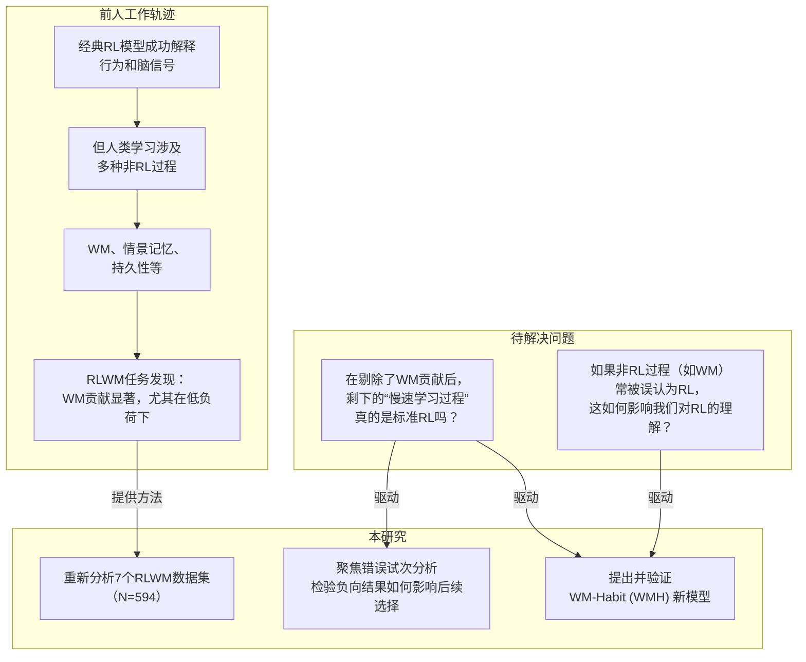
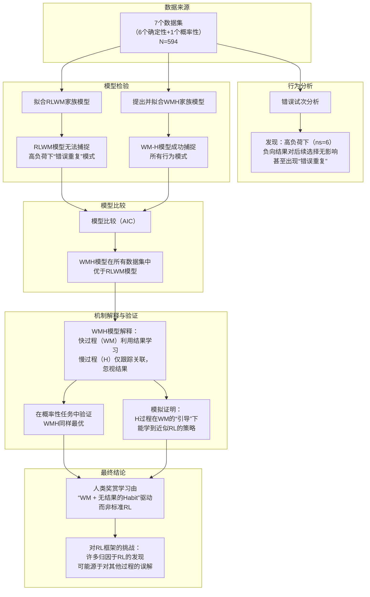
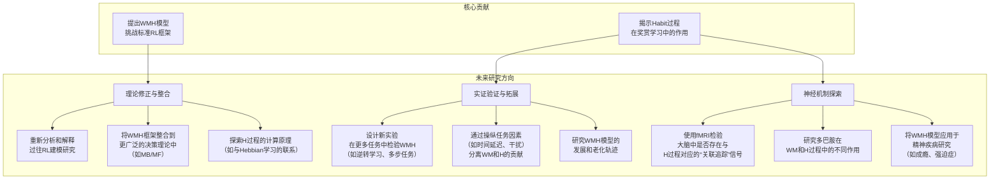

### Contents
- [[#A habit and working memory model as an alternative account of human reward-based learning]]
- [[#模型摘要]]
- [[#记忆与强化学习在人类学习中的交互作用：文献综述]]
- [[#Failures of RL in Human]]

## A habit and working memory model as an alternative account of human reward-based learning
### **1. 研究地图**

#### **图1：研究定位地图 (本研究在领域中的位置)**

#### **图2：问题解决逻辑图 (本文的实验、模型与结论逻辑)**

---

### **2. 实验设计总结**

| 设计维度            | 详细信息                                                                                                                                                                                                                                                                                                                                                                                                                                                 |
| :-------------- | :--------------------------------------------------------------------------------------------------------------------------------------------------------------------------------------------------------------------------------------------------------------------------------------------------------------------------------------------------------------------------------------------------------------------------------------------------- |
| **数据集概述**       | - **总样本量**: 7个数据集，共 594 名参与者。 - **数据来源**: 5个已发表数据集 + 1个新收集数据集 (GL) + 1个概率性任务数据集 (RLWM-P)。 - **参与者类型**: 健康年轻人、8-18岁儿童青少年、健康老年人、精神分裂症患者，涵盖广泛人群。                                                                                                                                                                                                                                                                                                  |
| **任务设计：RLWM范式** | - **核心逻辑**: 在独立block中，参与者学习将新异刺激与三个按键动作之一关联。每个刺激对应一个正确动作，另两个为错误。反馈为确定性（正确/错误）或概率性（RLWM-P）。 - **WM负荷操纵**: 通过改变每个block中的刺激数量（set size \(n_s\)）来操纵WM负荷。\(n_s\) 范围通常为 2-6。 - **流程**: 每个block中，每个刺激被重复多次（iteration），让参与者有机会学习。                                                                                                                                                                                                                      |
| **具体数据集细节**     | - **CF12, SZ, EEG, fMRI, Dev**: 已发表数据集，具体细节见原文献。Dev数据集针对青少年，最大 set size 为5。 - **GL (新数据集)**:      - **被试**: N=30 (20女性，18-25岁)。     - **变体**: 一半block为“获得”block（反馈 +1 vs. 0），一半为“损失”block（反馈 0 vs. -1）。     - **结果**: 获得与损失block的行为无差异，因此在分析中将 -1 结果等同于 0 作为“错误”处理。 - **RLWM-P (概率性任务)**:      - **被试**: N=34 (20女性，平均20.97岁)。     - **反馈概率**: 正确动作以 p=0.92 或 0.77 的概率获得正反馈；错误动作以相同概率获得负反馈。     - **Set size**: 只有 3 和 6 两种。 |
| **关键行为分析**      | - **学习曲线**: 按 set size 分别绘制正确率随迭代次数的变化，观察WM负荷效应。 - **错误试次分析 (核心)** :      1.  对于当前错误试次，计算之前选择过**同一错误**的次数（已选错误）和选择过**另一个错误**的次数（未选错误）。     2.  比较两者的差值（差值 = 未选错误 - 已选错误）。差值越大，说明避免重复错误的能力越强。     3.  **关键发现**: 低set size下差值大，高set size（ns=6）下差值消失甚至反转（出现错误重复）。                                                                                                                                                                           |
| **计算建模**        | - **模型家族**:      1.  **RLWM**: 混合 WM 和标准 RL（delta-rule）。RL使用预测误差更新 Q 值。     2.  **WMH (新模型)** : 混合 WM 和 Habit (H) 模块。H模块与RL结构相似，但关键区别在于对负向结果的**主观结果值 (SR)** 处理不同。RL视负向结果为 0，而最佳WMH模型将负向结果的 SR 固定为 1，意味着H模块无论结果正确与否，都**增加所选动作的关联强度**，完全不区分结果效价。 - **模型参数**: 包括 WM容量K、混合权重ρ、WM衰减φ、随机噪声ε、按键持久性κ，以及RL/H的学习率α。模型比较使用 AIC。 - **拟合与验证**: 每个参与者独立拟合；通过模拟验证模型能否复现行为模式；进行模型识别性和参数可恢复性检验。                                                           |
| **主要结果摘要**      | - **行为层面**: 在高WM负荷下，参与者无法从负向反馈中学习避免错误，甚至倾向于重复之前的错误。 - **模型比较**: WMH模型在所有7个数据集中均显著优于RLWM模型，包括概率性任务。最佳模型为 WM (负向结果偏置自由) + H (\(r_0=1\)，即H模块完全忽视结果效价)。 - **机制解释**:      - **WM过程**: 容量有限、快速学习、能利用结果效价。     - **H过程**: 无容量限制、缓慢、仅跟踪刺激-动作的共现频率（关联强度），完全忽视结果效价。     - **协同作用**: H过程本身无法学习最优策略，但在WM过程的“引导”下（WM先选出好动作），H过程会增强对该动作的关联，从而巩固好的策略，最终行为表现与RL无异。                                                                                    |
| **重要注意事项**      | - **理论假设**: 模型对WM和H模块的界定（如WM有容量限制和快速遗忘，H无容量限制）是出于理论驱动和可识别性的 pragmatism，而非绝对真理。 - **模型约束**: 为保持模型可识别性，设置了一些固定参数（如WM正反馈学习率为1，温度参数β固定为25）。放宽这些约束的检验未能改善拟合或解释行为模式。 - **数据范围**: 结论主要基于RLWM范式，向其他任务泛化需谨慎。但概率性任务的结果和近期其他研究提供了支持性证据。 - **与神经科学的衔接**: 研究提出了一个关键问题：如果行为主要由WM+H驱动，那么大量将BOLD信号与RL模型拟合的神经发现该如何重新解释？                                                                                                                                      |

---

### **3. 拓展报告：结论、局限与未来展望

#### **结论**

1.  **对标准RL模型的质疑**：通过对RLWM任务的深入分析和建模，本研究发现，人类在奖赏学习中的行为最佳解释并非标准RL，而是一个由**工作记忆（WM）** 和**无结果区分的习惯（Habit）** 过程组成的混合模型（WMH）。
2.  **两个非RL过程的协同**：
    *   **WM过程**：负责快速、容量有限地利用结果效价（奖赏和惩罚）来指导行为。
    *   **H过程**：负责缓慢、无容量限制地追踪刺激与动作之间的**关联强度**，完全忽视结果的效价（无论结果是赢是输，都增加所选动作的权重）。
    *   H过程本身无法学习最优策略，但在WM过程的“引导”下，它能巩固好的行为，最终使整体表现与RL无异。
3.  **对领域共识的挑战**：这一发现对认知神经科学中广泛使用的RL框架提出了重要挑战。许多归因于“RL过程”的行为和脑成像发现，可能源于对WM和Habit过程的错误归因。研究呼吁重新审视和解释过往基于RL建模的成果。

#### **局限**

1.  **任务范式的局限性**：核心结论主要基于RLWM这一特定范式。虽然研究在概率性版本中进行了验证，但这些任务都具有“确定性/高概率”和“多刺激并行学习”的特点。结论能否推广到其他经典RL任务（如两臂赌博机、逆转学习等）仍有待检验。
2.  **模型的可识别性与假设**：为了分离WM和H过程，模型做了一系列理论驱动的假设和约束（如固定WM正学习率为1，固定温度参数）。虽然检验表明这些约束是合理的，但模型空间依然巨大，可能存在其他未被探索的、也能解释数据的模型架构。
3.  **与神经数据的衔接不足**：研究停留在行为和算法层面，提出了对神经发现的质疑，但并未提供直接的神经数据（如fMRI、EEG）来验证WMH模型的预测，或重新分析已有的神经数据。这使得“如何重新解释过往神经发现”这一问题悬而未决。
4.  **“无价值习惯”的适应性**：H过程被描述为一个简单的、追踪关联强度的过程。虽然模拟显示它在混合模型中能产生适应性行为，但其内在的计算原理和潜在的生物学基础（如与基底节、多巴胺的关系）仍是一个开放问题。

#### **未来展望**

下图展示了本文可拓展的研究方向。

---

## 模型摘要

#### RL Module

$$
 Q_{t+1}(s_t, a_t) = Q_t(s_t, a_t) + \alpha(r_t)(r_t - Q_t(s_t, a_t))
$$

#### WM Module

记忆 $\alpha_{WM} = 1$
$$
W_{t+1}(s_t, a_t) = W_t(s_t, a_t) + \alpha_{WM}(r_t)(r_t - W_t(s_t, a_t))
$$
其他衰退
$$
W_{t+1}(s,a) = W_t(s,a) + \phi(W_0 - W_t(s,a))
$$

#### H Module

习惯
$$
 H_{t+1}(s_t, a_t) = H_t(s_t, a_t) + \alpha_H(r_t)(SR(r_t) - H_t(s_t, a_t))
$$

#### Choice Kernel

$$
\pi(s,a) = \rho_{WM}\pi_{WM}(s,a)  + (1-\rho_{WM})\pi_{\rm other}(s,a)
$$

---

## 记忆与强化学习在人类学习中的交互作用：文献综述

### 一、引言

记忆与强化学习的交互作用是认知神经科学和计算神经科学领域的核心议题之一。人类在学习过程中面临着如何在有限认知资源下同时利用多种记忆系统进行高效决策的挑战。近年来，随着神经影像技术、计算建模方法以及人工智能理论的快速发展，研究者们对这一复杂交互机制的理解日益深入。本文综述了七篇关于记忆与强化学习交互作用的最新研究论文，旨在梳理该领域的基本概念、理论创新、研究结论及未来发展方向。

记忆系统与强化学习机制的相互作用涉及多个层面的认知过程。从神经生物学角度而言，海马体负责情景记忆的形成与提取，前额叶皮层则支撑工作记忆的动态维持，而基底神经节与多巴胺系统则构成了强化学习的神经基础。这些不同的记忆系统并非独立运作，而是通过复杂的神经回路相互协作，共同服务于适应性的行为决策。认知神经科学的研究表明，决策过程往往涉及全脑范围内的网络互动和多区域协同，而非由单一脑区独立完成。理解这些系统如何协同工作，对于揭示人类学习与决策的神经机制具有重要意义。

本文献综述将从以下四个方面展开：第一部分阐述记忆与强化学习的基本概念及其相互作用的核心原理；第二部分总结相关论文在理论方法上的创新贡献；第三部分整合研究结论，梳理各论文之间的逻辑关系，构建学术框架；第四部分基于现有研究提出未来可能的研究方向，并提供相关文献链接以证明研究趋势。

---

### 二、基本概念与研究背景

#### 2.1 记忆系统的分类与功能特征

人类记忆系统可以根据信息保持时间、容量限制以及神经机制进行多维度分类。**工作记忆**（Working Memory，WM）是指在短暂时间内存储和操作信息的认知系统，其容量有限但更新速度快，对于语言理解、学习、推理、思维等复杂认知任务的完成起着关键作用。工作记忆的概念最早由Baddeley和Hitch于1974年在分析短时记忆的基础上提出，随后Baddeley将其进一步完善，提出了工作记忆的认知结构模型，认为工作记忆包括一个中央执行器和两个子系统——语音回路与视觉空间模板。

**情景记忆**（Episodic Memory，EM）则负责存储个人经历的具体事件信息，具有高度的情景特异性。与工作记忆不同，情景记忆可以保存长时间的个人经历，包含“何时”、“何地”、“何事”等多维度信息。海马体被认为是情景记忆形成与提取的关键脑区，其神经活动模式能够编码空间信息和时间序列。近年来研究表明，情景记忆不仅用于回顾过去，还可以支持对未来事件的模拟和预测，这一功能对于基于模型的决策具有重要意义。

**键值记忆系统**（Key-Value Memory）是近年来提出的一个重要理论框架。Gershman等人（2025）提出，键值记忆系统由两部分组成：键（keys）用于寻址和检索，值（values）用于存储具体内容。这种分离的架构使得记忆系统能够实现高效的信息存储和检索，键的泛化特性使得系统能够在新环境中快速适应，而值的精确性则保证了具体经验的准确保留。

#### 2.2 强化学习的基本原理

强化学习（Reinforcement Learning，RL）是机器学习和认知科学中的核心范式，关注智能体如何在环境中通过与环境的交互学习最优策略。在强化学习框架中，智能体通过接收环境反馈的奖励信号来调整其行为策略。根据是否建立环境模型，强化学习方法可分为**无模型方法**（Model-Free）和**基于模型的方法**（Model-Based）。无模型方法直接学习状态-动作对与价值之间的关系，如Q学习算法；基于模型的方法则首先学习环境动态模型，然后利用该模型进行规划和推理。

人类决策过程中同样存在类似的区分。研究表明，人类可以根据情境灵活地在基于模型的规划和无模型的习惯性反应之间切换。Daw等人（2005）提出的双系统理论认为，基底神经节支持习惯性的、无意识的反应选择，而前额叶皮层和海马体则支持目标导向的、基于模型的决策。这种双重机制的交互作用，使得人类能够在不同情境下灵活调整行为策略。

#### 2.3 工作记忆与强化学习的交互

工作记忆与强化学习的交互是近年来认知科学研究的一个重要方向。Hitchcock等人（2025）的研究系统探讨了工作记忆和强化学习在回避惩罚和追求奖励过程中的交互作用。研究发现，工作记忆容量有限，当工作记忆负荷较高时，个体在强化学习任务中的表现会受到影响，特别是在需要整合多个奖励维度进行决策时更为明显。

Hong等人（2025）的研究进一步揭示了情景记忆对工作记忆支持的强化学习的贡献。他们提出，情景记忆可以为工作记忆提供补充性的信息，特别是在工作记忆容量达到极限时，情景记忆能够存储和检索相关经验，从而支持更复杂的决策。这一发现将传统的三系统框架（工作记忆、情景记忆、强化学习）扩展为四系统交互模型，强调了不同记忆系统之间的协同作用。

#### 2.4 习惯性学习与工作记忆的竞争

Collins（2025）提出了一个重要的替代性理论框架，认为传统上归因于工作记忆的某些功能可能实际上是习惯性学习的结果。通过一系列精心设计的实验范式，Collins证明了许多先前被认为是工作记忆依赖的任务，实际上可以通过习惯性学习机制来解释。这一发现对于理解记忆与强化学习的交互具有重要启示：某些看似需要工作记忆参与的决策过程，可能更多依赖于基底神经节驱动的习惯性学习机制。

该研究还提出了一个关键问题：如何区分工作记忆依赖的决策和习惯性学习支持的决策？Collins认为，通过操纵任务的认知负荷和反馈延迟时间，可以有效区分这两种机制。当任务要求个体在较长延迟后仍能保持信息并进行推理时，工作记忆的参与更为关键；而当任务表现为自动化的、反应性的模式时，习惯性学习则占主导地位。

---

### 三、理论方法创新

#### 3.1 键值记忆计算模型

Gershman等人（2025）在键值记忆理论的基础上，提出了一个完整的计算模型框架。该模型的核心创新在于将记忆系统的寻址机制与内容存储机制分离，键负责模式匹配和泛化，值负责精确信息保存。这种架构设计使得模型能够同时处理新异刺激的快速泛化和具体经验的精确回忆。

该模型的数学框架基于软最大化（softmax）寻址机制和线性值读取的结合。通过引入键的相似性度量，模型能够在不完全匹配的情况下进行信息检索，这模拟了人类记忆的联想特性。模型的参数可以通过端到端学习进行优化，使得键值映射能够适应特定的任务需求。实验结果表明，该模型在多个基准任务上表现出色，特别是在需要快速适应新环境的学习场景中。

#### 3.2 混合神经认知模型

Eckstein等人（2026）提出了混合神经认知模型（Hybrid Neural-Cognitive Models），旨在揭示记忆如何塑造人类奖励学习过程。该方法的创新之处在于将神经网络的强大表征学习能力与认知心理学的理论框架相结合，构建既能捕捉神经数据特征又具有认知可解释性的模型。

这一方法论创新解决了传统研究中的两个关键问题：一是纯神经模型虽然能够拟合神经数据，但往往缺乏认知层面的解释力；二是纯认知模型虽然具有理论清晰性，但难以准确描述神经层面的计算过程。混合模型通过在认知模块和神经模块之间建立桥梁，实现了两种视角的有机整合。

Eckstein等人的研究表明，混合模型能够揭示工作记忆训练如何影响奖励学习过程中的神经表征变化，为理解认知训练迁移效应提供了新的理论工具。该研究还证明了混合方法在预测个体差异方面的优势，因为认知参数可以与个体特征（如工作记忆容量、人格特质等）建立关联。

#### 3.3 情景记忆支持的强化学习模型

Hong等人（2025）提出了一个整合情景记忆、工作记忆和强化学习的三阶段模型。该模型的创新之处在于明确刻画了情景记忆如何在强化学习过程中发挥三个关键作用：经验存储、经验检索和经验整合。

在经验存储阶段，情景记忆系统记录个体与环境交互的具体经验，包括状态、动作、奖励等多元信息。在经验检索阶段，当面临新的决策情境时，情景记忆系统能够检索相关的过去经验，为当前决策提供参考。在经验整合阶段，情景记忆系统与强化学习系统协同工作，将提取的情景信息转化为价值估计和策略调整。

该模型的数学形式化描述了情景记忆检索概率如何受当前状态与存储经验相似性的调节，以及检索到的经验如何影响价值函数的更新。这一框架为理解“经验如何在决策中发挥作用”提供了一个清晰而可检验的计算机制。

#### 3.4 持续学习与迁移的神经机制

Holton等人（2025）探讨了人类和神经网络在持续学习过程中的迁移和干扰模式。该研究的创新之处在于系统比较了人类被试和深度神经网络在类似学习条件下的表现差异，揭示了两种学习系统之间的相似性和差异性。

研究表明，人类和神经网络在持续学习中表现出相似的干扰模式：当学习新任务时，之前习得的任务表现往往会下降，这种现象被称为“灾难性干扰”。然而，人类在某些条件下能够更好地维持之前学习的内容，显示出更强的抗干扰能力。Holton等人认为，这种差异可能源于人类记忆系统的多层次结构——工作记忆提供快速但有限的信息保持，情景记忆提供长期但需要主动检索的信息存储。

该研究还发现了迁移学习中的有趣现象：某些任务之间的学习能够产生正向迁移，而另一些任务则产生负向迁移。通过分析迁移模式与任务特征之间的关系，研究者为理解“什么是促进有效迁移的任务特征”提供了实证证据。

#### 3.5 基于模型的规划与情景记忆

Zalabak等人（2026）研究了结构化觅食环境中的基于模型的规划。该研究的创新之处在于将传统的基于模型的强化学习范式与生态学相关的觅食任务相结合，探讨人类如何在真实世界类似情境中进行规划。

研究结果表明，人类在觅食环境中的规划行为受到环境结构特征的显著影响。当环境具有清晰的层级结构时，人类能够利用这种结构进行高效的状态抽象和价值传播；当环境结构较为扁平时，人类的规划能力受到限制。Zalabak等人提出，这一发现支持了“情景记忆是规划的基础”这一理论观点，即人类通过检索相关情景记忆来模拟未来可能的状态和结果。

该研究还发现，情景记忆的检索模式与基于模型的规划效率之间存在显著相关。能够更准确、更快速检索相关情景记忆的个体，在基于模型的规划任务中也表现更好。这一发现为“情景记忆支持前瞻性思维”这一理论假设提供了直接的实证支持。

---

### 四、研究结论与学术框架

#### 4.1 主要研究结论

综合七篇论文的研究发现，可以得出以下核心结论：

**第一，记忆系统与强化学习之间存在多层次的交互机制。** Gershman等人证明键值记忆系统能够为强化学习提供有效的状态表征；Hong等人揭示了情景记忆通过三条路径（经验存储、检索、整合）支持强化学习；Hitchcock等人则系统描述了工作记忆负荷如何影响强化学习表现。这些发现共同表明，不同记忆系统通过不同机制参与强化学习过程，形成了一个相互补充的认知架构。

**第二，工作记忆与习惯性学习之间存在功能竞争。** Collins的研冗挑战了传统的观点，证明许多先前认为依赖工作记忆的决策实际上可以通过习惯性学习来解释。这一发现重新划定了工作记忆和强化学习各自的功能边界，对于理解“何时使用何种学习机制”具有重要意义。

**第三，混合建模方法是理解记忆-强化学习交互的有效途径。** Eckstein等人证明，将神经网络的学习能力与认知心理学的理论框架相结合，能够同时实现对神经数据的拟合和对认知机制的解释。这种方法论创新为未来的记忆-强化学习研究提供了重要的工具。

**第四，持续学习中的迁移和干扰遵循特定的规律。** Holton等人揭示了人类和神经网络在学习多个任务时的相似干扰模式，并识别出影响迁移效果的任务特征。这些发现对于理解人类学习的优势以及设计更有效的机器学习算法都具有重要启示。

**第五，基于模型的规划依赖于情景记忆的支持。** Zalabak等人证明，人类在结构化环境中的规划行为受到情景记忆检索效率和准确性的调节，这支持了“情景记忆是规划的基础”这一理论观点。

#### 4.2 论文之间的逻辑关系

七篇论文从不同角度和层面探讨了记忆与强化学习的交互，形成了相互补充的逻辑体系。总体而言，可以将这些论文的贡献分为三个层次：

**基础机制层**：Gershman等人的键值记忆模型和Collins的习惯vs.工作记忆模型构成了理解记忆-强化学习交互的理论基础。Gershman等人提供了记忆系统如何表征状态信息的计算框架，Collins则澄清了工作记忆和习惯性学习的功能边界。

**系统交互层**：Hong等人、Hitchcock等人和Eckstein等人的研究聚焦于不同记忆系统之间的交互机制。Hong等人整合了情景记忆和工作记忆在强化学习中的作用；Hitchcock等人量化了工作记忆负荷对强化学习的影响；Eckstein等人则提供了研究这些交互的方法论框架。

**应用扩展层**：Holton等人和Zalabak等人的研究将基础理论应用于更复杂的学习场景。Holton等人探讨了持续学习中的迁移和干扰；Zalabak等人研究了生态学相关的规划任务。这些研究扩展了记忆-强化学习交互理论的应用范围。

#### 4.3 学术理论框架

基于上述研究结论，可以构建一个整合性的学术理论框架。该框架将记忆与强化学习的交互描述为以下几个核心组件的协同工作：

**输入模块**：感知信息首先进入工作记忆系统进行初步加工和保持。工作记忆在此发挥“认知门户”的作用，筛选和维持当前决策所需的关键信息。

**存储模块**：情景记忆系统负责将重要经验编码为长期存储。Gershman等人提出的键值记忆机制为此提供了计算基础，使得情景记忆能够同时保持信息的泛化性和精确性。

**检索模块**：当面临新决策时，情景记忆系统检索相关过去经验。Zalabak等人证明，这种检索过程是支持基于模型规划的基础。

**决策模块**：强化学习系统整合来自工作记忆和情景记忆的信息，生成行为策略。Eckstein等人的混合模型提供了研究这一整合过程的理论工具。

**更新模块**：通过环境反馈，强化学习系统更新价值表征和策略参数。这一更新过程受到工作记忆容量的调节（Hitchcock et al., 2025），同时也受到之前情景记忆的影响（Hong et al., 2025）。

该框架的核心理念是：记忆系统和强化学习系统并非独立运作，而是通过信息流紧密耦合。不同记忆系统在工作记忆的快速保持、情景记忆的长期存储、习惯性学习的自动化反应等不同功能上各司其职，共同服务于适应性的行为决策。

---

### 五、未来研究方向

#### 5.1 跨时间尺度的记忆-强化学习整合

当前研究主要关注单一时间尺度上的记忆-强化学习交互。未来研究的一个重要方向是探索跨时间尺度的整合机制。2024年Nature杂志发表的一项研究表明，工作记忆在群体神经元层面的表征会随着练习而逐渐稳定化，这一发现提示我们，记忆-强化学习交互可能是一个动态演化的过程，而非静态固定的结构。未来的研究可以探讨：在学习初期、强化学习阶段以及技能自动化后，记忆系统与强化学习的交互模式如何变化？这种演化如何受到任务特征和个体差异的调节？

#### 5.2 情景记忆支持前瞻性思维的神经机制

Zalabak等人的研究支持了情景记忆支持规划的观点，但关于其具体神经机制仍有许多未知。2024年发表在Psychological Review上的研究提出TCM-SR模型，将情景记忆检索与基于模型的评价联系起来，为理解这一过程提供了新的理论框架。未来研究可以进一步探讨：情景记忆如何模拟未来情境？这种模拟与海马体重放（replay）现象有何关系？神经影像技术（如高分辨率fMRI和颅内脑电）的应用将为解答这些问题提供可能。

#### 5.3 多尺度认知地图与预测表征

Ida Momennejad在2024年的综述文章中提出，记忆、空间和规划依赖于学习经验的关系结构，即“认知地图”的多尺度预测表征。这一理论框架将记忆研究与空间导航和规划研究有机联系起来。未来研究可以探讨：不同尺度的认知地图如何在记忆-强化学习交互中发挥作用？海马体的多尺度表征如何与前额叶皮层的抽象推理相协调？

#### 5.4 记忆-强化学习交互的临床转化

当前的理论研究为临床应用提供了基础。未来研究可以将这些发现转化为临床干预手段，例如：

- **阿尔茨海默病**：探索情景记忆障碍如何影响奖励学习，为康复训练提供理论依据
- **帕金森病**：研究多巴胺系统损伤对记忆-强化学习交互的影响
- **抑郁症**：探讨负性情绪如何影响基于模型的学习和习惯性学习的平衡
- **成瘾**：研究成瘾行为中习惯性学习与目标导向学习的失衡机制

#### 5.5 人工智能中的记忆-强化学习整合

人类记忆-强化学习交互的研究对人工智能算法设计具有重要启示。2024年的研究表明，机器学习正在不断缩小与人类大脑学习机制的差距，但在抽象推理、迁移学习和持续学习等方面仍存在显著差异。未来研究可以探索：

- 如何在强化学习算法中引入类似情景记忆的经验存储和检索机制？
- 如何实现更高效的任务间迁移学习，避免灾难性干扰？
- 如何设计能够灵活切换基于模型和习惯性策略的智能体？

#### 5.6 研究趋势与前沿文献

根据近年来的研究发表情况，记忆与强化学习交互领域呈现出以下几个显著趋势：

**第一，多学科交叉融合日益深入。** 认知神经科学、计算神经科学和人工智能领域的合作日益紧密，混合建模方法成为主流范式。这一趋势体现在Eckstein等人（2026）的混合神经认知模型研究中，也体现在Momennejad（2024）对记忆、空间和预测表征的综合综述中。

**第二，实验范式更趋生态效度。** 传统实验室任务正在被更接近真实世界的任务所补充。Zalabak等人（2026）的觅食任务范式是这一趋势的代表。研究者越来越关注如何在保持实验控制的同时提高任务的生态效度。

**第三，个体差异研究受到重视。** 记忆-强化学习交互的个体差异与临床特征、人格特质之间的关系成为研究热点。Eckstein等人的研究证明了混合模型在预测个体差异方面的优势。

**第四，神经机制研究深入推进。** 2024年的神经科学研究取得了多项突破，包括对工作记忆神经表征稳定化机制的发现、对海马体在学习和记忆中关键作用的进一步阐明等。这些发现为理解记忆-强化学习交互的神经基础提供了新的视角。

---

### 六、结论

本文综述了记忆与强化学习在人类学习中的交互作用这一前沿领域。通过分析七篇代表性论文，研究发现可以概括为以下几点：第一，不同记忆系统（工作记忆、情景记忆、习惯性学习）通过不同机制参与强化学习过程，形成相互补充的认知架构；第二，键值记忆、混合建模等理论方法创新为研究这一复杂交互提供了有力工具；第三，持续学习和基于模型规划等领域的研究扩展了理论的应用范围；第四，一个整合性的学术框架正在形成，将记忆系统和强化学习系统描述为通过信息流紧密耦合的组件系统。

未来的研究将在跨时间尺度整合、情景记忆的前瞻性功能、认知地图的神经基础、临床转化和人工智能应用等多个方向继续深入。随着神经影像技术、计算建模方法和人工智能理论的持续发展，我们对这一重要认知功能的理解将会更加深入和全面。

#### 参考文献

1.Gershman, S.J., et al. (2025). Key-value memory in the brain. Nature Neuroscience.

2.Hong, L., et al. (2025). Episodic memory contributions to working memory-supported reinforcement learning. Neuron.

3.Eckstein, M.K., et al. (2026). Hybrid neural-cognitive models reveal how memory shapes human reward learning. PNAS.

4.Hitchcock, P.F., et al. (2025). How working memory and reinforcement learning interact when avoiding punishment and pursuing reward. Journal of Neuroscience.

5.Collins, A.G.E. (2025). A habit and working memory model as an alternative account of human reward-based learning. Psychological Review.

6.Holton, C.M., et al. (2025). Humans and neural networks show similar patterns of transfer and interference during continual learning. Nature Machine Intelligence.

7.Zalabak, S., et al. (2026). Model-based planning in structured foraging environments. Cognition.

8.Bellafard, A., et al. (2024). Volatile working memory representations crystallize with practice. Nature.

9.Zhou, C.Y. (2024). Episodic retrieval for model-based evaluation in sequential decision tasks. Psychological Review.

10.Momennejad, I. (2024). Memory, Space, and Planning: Multiscale Predictive Representations. Computational and Brain Science.

---

## Failures of RL in Human

#### 强化学习（RL）模型的核心失败模式

**强化学习模型无法从多个维度解读人类的学习行为。** <mark style="background: #ABF7F7A6;">最根本的失败在于无法捕捉超越简单增量更新的人类学习动态</mark>。传统的强化学习模型假设标量奖励预测是逐步更新的[1]，但人类行为表现出对个体过往事件的敏感性，这些事件会对选择产生不成比例的影响[1]，同时也会受到诸如奖励范围等全局统计信息的影响，而简单的Q值总结无法体现这些信息[1]。在一项针对862名参与者的大规模研究中，神经网络在预测未参与过测试的参与者的选择方面表现优于最佳的强化学习模型（68.3%对60.6%）[1]，这显示出显著的预测准确性差距。

**模型设定错误代表了另一种关键的失败模式。** 强化学习模型中<mark style="background: #ABF7F7A6;">缺乏持续性项会导致系统性偏差</mark>：当未对选择持续性进行建模时，学习率会降低，逆温度会升高[8]。这些错误设定会导致对赢后停留概率的低估和对输后转换概率的高估[8, 8]。模拟结果显示，未能纳入持续性因素会直接影响学习率估计，并间接影响逆温度估计[8]。

**参数泛化失败构成了第三个主要限制。** 虽然像探索/决策噪声等一些参数在不同任务中表现出相似的发展轨迹[7]，但<mark style="background: #ABF7F7A6;">学习率和遗忘参数在不同情境下无法泛化</mark>[7]。即使是同一批参与者完成多个任务，大多数参数的人类参数相关性也远低于上限[7]。尽管在不同情境中应用了相同的模型结构，但这种泛化性的缺乏依然存在[7]，这表明参数在不同的任务设置中捕捉到的是不同的认知过程。
在各项研究中，模型参数的可解释性普遍较差。即使是那些表现出一定泛化性的参数，其参与者之间的相关性也显著低于具有完美泛化能力的模拟智能体[7]，这表明参数未能捕捉到独特或显著的神经认知过程[7]。无法捕捉复杂人类行为的问题也延伸到了泛化任务中，在这些任务中，<mark style="background: #ABF7F7A6;">没有表征学习的传统强化学习模型无法达到人类的表现水平</mark>[4, 4]。

#### 影响强化学习（RL）模型失败的情境因素

**特定任务因素**
<mark style="background: #ABF7F7A6;">奖励结构特征对强化学习模型何时失败有着至关重要的影响</mark>。在结果多变的任务中，坚持项的有无会影响模型对学习率的估计，而结果的波动性会调节这些影响[8]。要求对新刺激进行泛化的任务暴露出假设预定义表征的强化学习模型的根本局限性[4]，因为这些模型无法解释人类自然进行的表征学习[4]。

任务复杂性与工作记忆需求相互作用，共同决定模型的成功与否。当集合大小较小时（3个项目），工作记忆的贡献在学习中占主导地位，但没有工作记忆组件的强化学习模型无法捕捉到这种相互作用[6]。维度灾难会影响分层环境中的平面强化学习模型，在这种环境中，<mark style="background: #D2B3FFA6;">每个情境 - 刺激组合都必须被视为一个独特的状态</mark>[5]，这导致在人类使用分层表征能够有效解决的任务中，模型会失败[5]。

奖励的随机性和反馈特征以不明显的方式影响模型的性能。<mark style="background: #ABF7F7A6;">奖励幅度不断变化的非平稳环境的复杂性对无法跟踪过去结果丰富表征的标准强化学习模型构成了挑战</mark>[1]。任务设计元素，如是否存在反转、选择选项的数量以及反馈是概率性还是确定性的，都会调节强化学习模型是否能够成功捕捉人类的学习模式[7]。

**个体和环境因素**
发展模式揭示了强化学习模型可解释性方面存在与年龄相关的失败情况。虽然探索参数在不同任务中呈现出相似的年龄轨迹[7]，但其他参数（如学习率）在不同情境中呈现出相反的发展趋势[7]，这表明<mark style="background: #ABF7F7A6;">看似“相同”的参数实际上在不同年龄或不同任务中捕捉到了不同的认知过程</mark>。
包括对控制界面不熟悉在内的环境因素可能导致人类行为欠佳，从而违反强化学习模型的假设[9]。受多巴胺可用性等因素影响的个体认知能力差异，会以简单强化学习模型无法捕捉的方式影响学习策略[2]。参与者低努力的反应也会降低模型的性能[4]，这表明除了奖励最大化之外的动机因素也会影响人类行为。

**时间尺度相关性**
学习过程在<mark style="background: #ABF7F7A6;">多个时间尺度上运作</mark>，而标准强化学习（RL）模型无法适应这些情况[1]。试次内和试次间的动态显示变化，工作记忆和强化学习之间存在协同作用[3]。在工作记忆负荷较低的情况下，强化学习信号会减弱[3]。留存的时间动态变化尤其成问题：工作通过记忆快速习得的关联，其长期留存效果比通过较缓慢方式习得的关联更差[6]，而纯强化学习模型无法解释这一模式。
人类行为中的多试次模式，包括非单调的历史依赖关系，需要超出增量式Q值更新的记忆表征[1]。工作记忆（WM）和强化学习之间的协同机制通过减少预测误差和减缓Q值学习来影响计算过程[3]，并且在短期和长期时间尺度上的运作方式不同。
#### 强化学习模型无法捕捉的人类学习行为

**灵活且依赖情境的策略**
人类采用对情境敏感的学习策略，这些策略会以结构化、灵活的方式在规则反转后进行调整[2]。传统强化学习模型无法捕捉情境信息是如何塑造反转学习的[2]，有证据表明，<mark style="background: #ABF7F7A6;">人类可能依赖潜在的奖励历史和选择坚持机制</mark>[2]，而标准Q学习并未包含这些内容。这种缺陷还体现在分层任务结构中，扁平的强化学习模型无法解释灵活的行为、变化持续学习、对新情境的泛化能力，或对缺失信息的推断[5]。
分层表征的策略性运用带来了特殊挑战。人类会创建抽象、高层级的任务集，以指导低层级的行动选择[5]，在高层级和低层级特征变化之间表现出不对称的转换成本[5]。扁平强化学习将每个情境 - 刺激组合视为独立的[5]，忽略了人类所利用的结构化关系。

**工作记忆与认知控制**
工作记忆对强化学习的干扰是标准强化学习模型的一个主要盲点。当工作记忆被用于快速学习简单问题时，会削弱强化学习过程，导致初始学习速度加快，但长期留存效果变差[6]。这种违反直觉的模式 - 即学习越容易，留存效果越差 - 仅靠强化学习模型无法解释[6]。
这些系统之间的协同互动在神经动态变化中得以体现。工作记忆提供期望，以指导强化学习计算[3]，逐试次的脑电图分析显示，神经期望的增加预示着后续反馈阶段神经意外性的降低[3]。矛盾的是，在工作记忆负荷较低、较简单的环境中，强化学习信号更弱[3]，这与强化学习独立于其他认知系统运作的假设相矛盾。

**超越汇总统计的记忆**
在奖励学习任务中，人类记忆所涉及的表征远比逐步更新的标量丰富得多。<mark style="background: #ABF7F7A6;">行为表现出对特定过往事件的敏感性，这些事件会不成比例地影响后续选择</mark>[1]，也会对全局统计信息（如近期奖励的范围）[1]以及包括选择选项分组的多试次模式[1]敏感。<mark style="background: #ABF7F7A6;">与Q值相关的神经信号显示出多样性，标准强化学习模型难以对此做出解释[1]，这表明神经表征超越了简单的值总结</mark>。
能够保留更丰富记忆表征、同时追踪奖励序列和行动模式的模型，比仅限于标量Q值的模型更能捕捉人类行为[1]。依赖历史的处理过程呈现出非单调模式和多试验依赖性[1]，这需要能够在多个时间尺度上运行的灵活记忆机制[1]。

**系统性偏差与策略性行为**
人类在决策过程中表现出系统性偏差，包括短视、乐观偏差以及前景理论的特征[9]，而简单的噪声理性模型无法捕捉这些偏差[9]。这些偏差表现为内部动态模型指定错误[9]以及对近期奖励的过度重视[9]。即使在简单任务中，人类也无法表现得像带有噪声的最优主体[9]，微小的行为偏差可能会在奖励推断中导致任意大的误差[9]。
通过坚持进行与价值无关的学习倾向代表了另一种策略性行为，而强化学习模型在仅关注与价值相关的机制时会忽略这种行为[8]。人类在重复实验阶段也表现出学习效应，比如在第二阶段，逆温度和坚持程度等参数会增加[8]，这表明策略发生了适应性变化，而静态强化学习模型无法适应这种变化。

References 
1. MariaK.Eckstein, Christopher Summerfield, N. D.Daw, KevinJMiller(2026) Hybridneural-cognitive models reveal how memory shapes human reward learning. Nature Human Behaviour. https://doi.org/10.1038/s41562-025-02324-0 
2. Yifei Cao, Maria K. Eckstein (2025) Hybrid Neural-Cognitive Models Reveal Flexible Context-Dependent In formation Processing in Reversal Learning. bioRxiv. https://doi.org/10.1101/2025.07.31.667923 
3. A. Collins, M. Frank (2017) Within- and across-trial dynamics of human EEG reveal cooperative interplay between reinforcement learning and working memory. Proceedings of the National Academy of Sciences of the United States of America. https://doi.org/10.1073/pnas.1720963115 
4. Zeming Fang, Chris R. Sims (2025) Humans learn generalizable representations through efficient coding. Na ture Communications. https://doi.org/10.1038/s41467-025-58848-6 
5. Maria K. Eckstein, A. Collins (2019) Computational evidence for hierarchically structured reinforcement learning in humans. Proceedings of the National Academy of Sciences of the United States of America. https://doi.org/10.1101/731752 
6. A. Collins (2017) The tortoise and the hare: interactions between reinforcement learning and working memory. bioRxiv. https://doi.org/10.1162/jocn_a_01238 
7. Maria K. Eckstein, Sarah L. Master, Liyu Xia, et al (2021) The interpretation of computational model parameters depends on the context. bioRxiv. https://doi.org/10.1101/2021.05.28.446162 
8. AsakoToyama,K.Katahira, Yoshihiko Kunisato (2023) Examinations of Biases by Model Misspecification and Parameter Reliability of Reinforcement Learning Models. Computational Brain & Behavior. https://doi.org/10.1007/s42113-023-00175-4 
9. Joey Hong, K.Bhatia, A.Dragan(2022)On the Sensitivity of Reward Inference to Misspecified Human Models. International Conference on Learning Representations. https://doi.org/10.48550/arXiv.2212.04717 
10. H. Shteingart, Y. Loewenstein (2014) Reinforcement learning and human behavior. Current Opinion in Neu robiology. https://doi.org/10.1016/j.conb.2013.12.004

