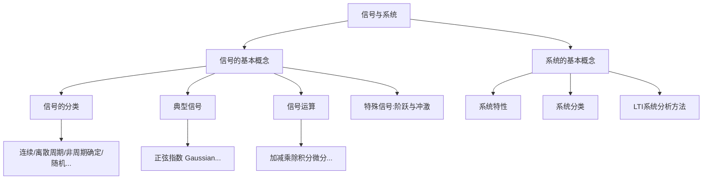
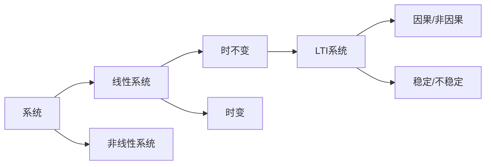
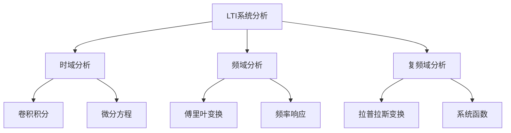

---

title: 信号与系统 L1 | 信号与系统概述

draft: false

tags:

  - 信号与系统

  - 基础概念

---

# 信号与系统概述

> [!note] 本章概述
> 本章介绍信号与系统的基本概念，为整个课程奠定基础。我们将了解什么是信号、什么是系统，以及它们之间的关系。

## 章节脉络

## 1.1 信号的基本概念

### 什么是信号？

**信号**是携带信息的物理量，是信息的表现形式。在数学上，信号通常表示为一个或多个变量的函数。

> [!tip] 直观理解
> 把信号想象成"信息的载体"，就像信封里的信。信的内容是信息，而信封就是承载信息的信号。

### 信号的分类

| 分类标准 | 类型 | 说明 |
|---------|------|------|
| **时间特性** | 连续时间信号 | 时间连续变化的信号 |
| | 离散时间信号 | 仅在特定时刻有定义的信号 |
| **数值特性** | 模拟信号 | 取值连续的信号 |
| | 数字信号 | 取值离散的信号（离散+量化） |
| **周期性** | 周期信号 | 随时间周期性重复 |
| | 非周期信号 | 不具有周期性 |
| **确定性** | 确定信号 | 可以用确定性函数描述 |
| | 随机信号 | 不能用确定性函数描述 |
| **能量特性** | 能量信号 | 总能量有限（$E < \infty$），平均功率为零 |
| | 功率信号 | 平均功率有限（$P > 0$），总能量无限 |
| **对称性** | 偶信号 | $x(-t) = x(t)$ |
| | 奇信号 | $x(-t) = -x(t)$ |

> [!tip] 能量与功率
> - **能量信号**：持续时间有限，如脉冲信号
> - **功率信号**：持续时间无限，如周期信号、阶跃信号
> - 两类信号互斥：一个信号不能既是能量信号又是功率信号（零信号除外）

> [!info] 连续时间信号与离散时间信号的关系
> - 连续时间信号：$x(t)$，$t$ 是连续变量
> - 离散时间信号：$x[n]$，$n$ 是整数离散时刻
> - 数字信号是离散时间信号经过**量化**后的结果

---

## 1.2 典型的连续时间信号

### 1. 正弦信号

$$x(t) = A\sin(\omega t + \phi)$$

其中：
- $A$：振幅
- $\omega$：角频率（$\omega = 2\pi f$）
- $\phi$：初相

> [!tip] 正弦信号的三个维度
> 正弦信号可以通过振幅、频率、相位三个参数完全描述，这三者构成了信号的"指纹"。

### 2. 指数信号

$$x(t) = Ce^{at}$$

- $C$：常数
- $a$：指数系数（可为实数或复数）

**复指数信号**是信号与系统分析中最重要的信号之一：
$$x(t) = e^{j\omega t} = \cos(\omega t) + j\sin(\omega t)$$

> [!important] 欧拉公式
> $$e^{j\omega t} = \cos(\omega t) + j\sin(\omega t)$$
> 这座"桥梁"连接了指数函数和三角函数，是傅里叶分析的理论基础。

### 3. 抽样函数 Sa(t)（sinc 函数）

$$Sa(t) = \frac{\sin t}{t}$$

或更一般地：
$$\text{sinc}(x) = \frac{\sin(\pi x)}{\pi x}$$

> [!tip] 抽样函数的性质
> - $Sa(0) = 1$（极限值）
> - $Sa(k\pi) = 0$（$k \neq 0$ 的整数倍处为零）
> - 积分性质：$\int_{-\infty}^{\infty} Sa(t) dt = \pi$
> - 抽样函数是矩形脉冲的傅里叶变换

### 4. 高斯信号（钟形曲线）

$$x(t) = A e^{-\frac{t^2}{\tau^2}}$$

> [!info] 实际应用
> 高斯信号在通信中有广泛应用，例如脉冲整形滤波器。高斯函数的傅里叶变换仍是高斯函数，这一性质在光学和信号处理中非常重要。

---

## 1.3 信号的运算

### 基本运算

| 运算 | 表达式 | 说明 |
|------|--------|------|
| **加法** | $x(t) = x_1(t) + x_2(t)$ | 两信号叠加 |
| **乘法** | $x(t) = x_1(t) \cdot x_2(t)$ | 调制的基础 |
| **尺度变换** | $x(at)$ | 时间轴缩放 |
| **时移** | $x(t - t_0)$ | 信号在时间轴上平移 |
| **微分** | $\frac{dx(t)}{dt}$ | 提取变化率 |
| **积分** | $\int_{-\infty}^{t} x(\tau)d\tau$ | 累积效果 |

> [!tip] 尺度变换的直观理解
> $x(2t)$ 相当于"2倍速播放"，信号被压缩；$x(t/2)$ 相当于"0.5倍速播放"，信号被拉伸。

---

## 1.4 阶跃信号和冲激信号

> [!note] 特殊信号的意义
> 阶跃信号和冲激信号是信号与系统分析中两个最重要的"奇异函数"，它们是构建其他信号的基本构件。

### 单位阶跃信号 $u(t)$

$$
u(t) = \begin{cases}
0, & t < 0 \\
1, & t > 0
\end{cases}
$$

在 $t=0$ 处的值可以定义为 $1/2$ 或任意值，通常不关心。

**性质**：
- 积分得到斜变信号
- 可以表示任意因果信号

### 单位冲激信号 $\delta(t)$

$$
\delta(t) = \begin{cases}
\infty, & t = 0 \\
0, & t \neq 0
\end{cases}, \quad \int_{-\infty}^{+\infty} \delta(t) dt = 1
$$

**性质**：

1. **筛选性（取样性）**：
$$x(t)\delta(t - t_0) = x(t_0)\delta(t - t_0)$$
$$\int_{-\infty}^{+\infty} x(t)\delta(t - t_0)dt = x(t_0)$$

2. **尺度变换**：
$$\delta(at) = \frac{1}{|a|}\delta(t)$$

3. **导数——冲激偶**：
$$\delta'(t) = \frac{d\delta(t)}{dt}$$
满足 $\int_{-\infty}^{+\infty} \delta'(t) dt = 0$

4. **冲激偶的取样性**：
$$x(t)\delta'(t - t_0) = x(t_0)\delta'(t - t_0) - x'(t_0)\delta(t - t_0)$$
$$\int_{-\infty}^{+\infty} x(t)\delta'(t - t_0) dt = -x'(t_0)$$

> [!info] 冲激偶的意义
> 冲激偶是冲激函数的导数，在信号处理中用于表示信号的跳变。冲激偶的积分性质在分析信号的不连续点时非常有用。

> [!tip] 冲激函数的直观理解
> 冲激函数可以想象成一个"无限窄、无限高但面积为一"的脉冲。它就像一个"瞬间点"，在极短时间内蕴含有限的"总能量"。

> [!important] 冲激函数的重要意义
> 冲激函数是连接连续时间系统和离散时间系统的桥梁，也是卷积积分和频域分析的基础。

---

## 1.5 系统的基本概念

### 什么是系统？

**系统**是对输入信号进行处理并输出信号的实体。简言之：
$$\text{系统}: y(t) = \mathcal{T}\{x(t)\}$$
其中 $\mathcal{T}$ 表示系统对输入信号进行的变换。

> [!tip] 系统的类比
> 把系统想象成一个"加工机器"：输入是原材料，输出是成品，而系统就是加工的工艺流程。

### 系统的特性

| 特性 | 定义 | 表达式 |
|------|------|--------|
| **线性** | 满足叠加性和齐次性 | $\mathcal{T}\{ax_1(t) + bx_2(t)\} = a\mathcal{T}\{x_1(t)\} + b\mathcal{T}\{x_2(t)\}$ |
| **时不变性** | 延迟输入导致延迟输出 | 若 $y(t) = \mathcal{T}\{x(t)\}$，则 $y(t-t_0) = \mathcal{T}\{x(t-t_0)\}$ |
| **因果性** | 输出不取决于未来输入 | $t < t_0$ 时 $x(t) = 0 \Rightarrow t < t_0$ 时 $y(t) = 0$ |
| **稳定性** | 有界输入产生有界输出 | $\|x(t)\| < M_x \Rightarrow \|y(t)\| < M_y$ |
| **记忆性** | 输出取决于当前及过去输入 | 无记忆系统：$y(t_0)$ 仅取决于 $x(t_0)$ |

> [!caution] 线性与时不变性的重要性
> 线性时不变系统（LTI系统）是信号与系统分析的核心研究对象。后面章节中讨论的傅里叶变换、拉普拉斯变换、Z变换等分析方法，都建立在LTI系统的假设之上。

### 系统的分类

---

## 1.6 LTI系统的分析方法

### 卷积积分

对于连续时间LTI系统，系统的输出可以表示为输入信号与单位冲激响应的**卷积**：

$$y(t) = x(t) * h(t) = \int_{-\infty}^{+\infty} x(\tau)h(t-\tau)d\tau$$

其中 $h(t)$ 是系统的**单位冲激响应**，即系统对单位冲激信号 $\delta(t)$ 的响应。

> [!important] 卷积的核心思想
> 卷积的本质是"加权叠加"：把输入信号分解为无数个冲激信号的叠加，每个冲激信号经过系统后产生一个延迟、加权的冲激响应，所有响应叠加得到最终输出。

### 分析方法框架

> [!info] 方法选择
> - **时域分析**：直观，但计算复杂
> - **频域分析**：适合周期信号和稳态分析
> - **复频域分析**：适合瞬态响应和系统稳定性分析

---

## 本章小结

> [!summary]
> 本章建立了信号与系统的基本概念框架：
> 1. **信号**是信息的载体，可分为连续/离散、周期/非周期、确定/随机等类型
> 2. **典型信号**包括正弦信号、指数信号、高斯信号等
> 3. **阶跃信号和冲激信号**是分析中的两个奇异函数，具有重要的筛选性质
> 4. **系统**是对信号进行处理的实体，线性时不变（LTI）系统是研究重点
> 5. LTI系统的输出可通过**卷积积分**计算

---

## 思考题

1. **判断题**：若系统既是线性的又是时不变的，那么它一定满足叠加性。这个说法是否正确？

   > [!answer]
   > **答案：正确**。线性满足齐次性和叠加性，时不变性是独立的性质。线性时不变系统同时满足这两个性质。

2. **选择题**：下列哪个不是线性系统的特性？
   - A. 叠加性
   - B. 齐次性
   - C. 稳定性
   - D. 可加性

   > [!answer]
   > **答案：C**。稳定性不是线性系统的特性，非线性系统也可以是稳定的。

3. **问答题**：解释为什么冲激函数在LTI系统分析中如此重要？

   > [!answer]
   > **答案要点**：
   > - 任何信号都可以表示为冲激信号的加权和（积分）
   > - LTI系统的线性性和时不变性使得输出是输入与单位冲激响应的卷积
   > - 冲激响应 $h(t)$ 完全描述了LTI系统的特性

---

## 发散拓展

### 信号与系统在实际中的应用

1. **通信系统**
   - 调制解调：利用信号的乘法运算将信息加载到载波上
   - 滤波：利用LTI系统的频率选择性处理信号
   - [MATLAB通信系统仿真](https://www.mathworks.com/solutions/communications.html)

2. **控制系统**
   - 系统建模：将物理系统抽象为微分方程
   - 稳定性分析：利用拉普拉斯变换和极点分布判断系统稳定性
   - [控制系统工具箱](https://www.mathworks.com/products/control.html)

3. **信号处理**
   - 音频处理：降噪、均衡、压缩
   - 图像处理：滤波、增强、识别
   - [数字信号处理教程](https://www.dsprelated.com/)

4. **生物医学工程**
   - ECG/EEG信号分析：心电图和脑电图的处理与诊断
   - 医学成像：CT、MRI的重建算法

> [!info] 延伸学习
> - 深入学习：参考 Oppenheim & Willsky 的《信号与系统》
> - 实践应用：学习 MATLAB/Python 信号处理工具箱
> - 后续内容：[[信号与系统 L2 | 连续时间信号的傅里叶级数]] 将深入讨论周期信号的频域表示
