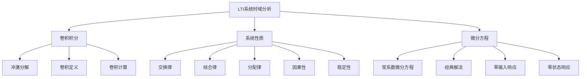
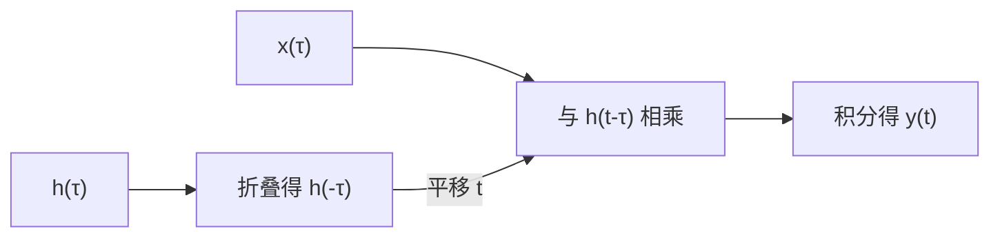
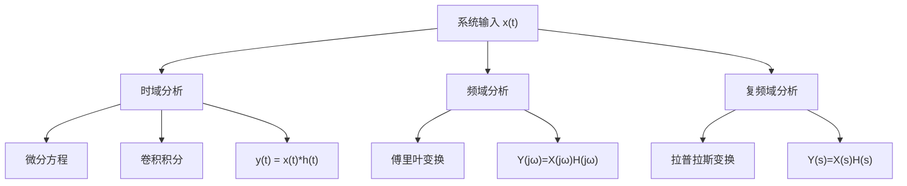

---

title: 信号与系统 L2 | 线性时不变系统的时域分析

draft: false

tags:

  - 信号与系统

  - LTI系统

  - 时域分析

---

# 线性时不变系统的时域分析

> [!note] 本章概述
> 本章进入LTI系统的核心分析方法。我们将学习如何用"卷积"这一强大工具来分析线性时不变系统，以及系统的时域特性（因果性、稳定性）与系统冲激响应之间的关系。

## 章节脉络

---

## 2.1 LTI系统的表示——卷积积分

### 2.1.1 冲激信号的分解

> [!important] 核心思想：化繁为简
> 任何连续时间信号 $x(t)$ 都可以表示为无数个加权冲激信号的叠加：
> $$x(t) = \int_{-\infty}^{\infty} x(\tau)\delta(t-\tau) d\tau$$

这个式子的含义是：在任意时刻 $\tau$，信号值 $x(\tau)$ 作为权重，乘以一个位于 $t = \tau$ 处的冲激函数，然后对所有时刻积分。

> [!tip] 直观理解
> 想象把一条连续的曲线分解成无数个"脉冲点"的叠加。每个时刻 $\tau$ 的信号值 $x(\tau)$ 就是那个时刻脉冲的"强度"。

### 2.1.2 卷积积分的定义

已知 LTI 系统的**单位冲激响应** $h(t)$（系统对 $\delta(t)$ 的响应），则系统对任意输入 $x(t)$ 的响应（**零状态响应**）为：

$$y(t) = x(t) * h(t) = \int_{-\infty}^{\infty} x(\tau)h(t-\tau) d\tau$$

其中 $*$ 表示卷积运算。

> [!caution] 卷积积分的物理意义
> 卷积积分可以理解为：**在每个时刻 $\tau$，输入信号 $x(\tau)$ 激发出一个加权的冲激响应 $x(\tau)h(t-\tau)$，所有这些响应叠加得到最终输出**。

### 2.1.3 卷积的计算方法

**图解法**（理解卷积几何意义的重要方法）：

1. **折叠**：将 $h(\tau)$ 关于纵轴折叠得到 $h(-\tau)$
2. **平移**：将 $h(-\tau)$ 平移 $t$ 个单位得到 $h(t-\tau)$
3. **相乘**：将 $x(\tau)$ 与 $h(t-\tau)$ 相乘
4. **积分**：计算乘积曲线下的面积

> [!example] 卷积计算举例
> **例**：求 $x(t) = u(t)$ 与 $h(t) = e^{-at}u(t)$ 的卷积
>
> **解**：
> $$y(t) = \int_{-\infty}^{\infty} u(\tau) \cdot e^{-a(t-\tau)}u(t-\tau) d\tau$$
> 由于 $u(\tau)$ 和 $u(t-\tau)$ 的限制，积分区间为 $0$ 到 $t$（$t > 0$）：
> $$y(t) = \int_0^t e^{-a(t-\tau)} d\tau = \frac{1}{a}(1 - e^{-at}), \quad t > 0$$

---

## 2.2 LTI系统的性质

### 2.2.1 卷积的基本性质

| 性质 | 表达式 | 说明 |
|------|--------|------|
| **交换律** | $x(t) * h(t) = h(t) * x(t)$ | 卷积次序无关 |
| **结合律** | $[x(t) * h_1(t)] * h_2(t) = x(t) * [h_1(t) * h_2(t)]$ | 级联系统等效 |
| **分配律** | $x(t) * [h_1(t) + h_2(t)] = x(t) * h_1(t) + x(t) * h_2(t)$ | 并联系统等效 |
| **微分性质** | $\frac{d}{dt}[x(t) * h(t)] = \frac{dx(t)}{dt} * h(t) = x(t) * \frac{dh(t)}{dt}$ | 卷积的导数等于导数的卷积 |
| **积分性质** | $\int_{-\infty}^{t}[x(\tau) * h(\tau)] d\tau = [\int_{-\infty}^{t} x(\tau) d\tau] * h(t) = x(t) * [\int_{-\infty}^{t} h(\tau) d\tau]$ | 卷积的积分等于积分的卷积 |

> [!important] 与特殊信号的卷积
> - $x(t) * \delta(t) = x(t)$（单位冲激是卷积的"单位元"）
> - $x(t) * \delta(t - t_0) = x(t - t_0)$（时移）
> - $x(t) * u(t) = \int_{-\infty}^{t} x(\tau) d\tau$（积分）
> - $\frac{dx(t)}{dt} * u(t) = x(t)$（微分与积分互为逆运算）

> [!info] 系统的连接
> - **级联**：$h(t) = h_1(t) * h_2(t)$
> - **并联**：$h(t) = h_1(t) + h_2(t)$
> 这两个性质使得复杂系统可以分解为简单系统的组合来分析。

### 2.2.2 冲激响应与系统特性

#### 因果性

> [!important] 因果系统的定义
> **因果系统**：输出不取决于未来输入的系统。
> $$x(t) = 0, \quad t < t_0 \Rightarrow y(t) = 0, \quad t < t_0$$

**冲激响应判定**：
$$h(t) = 0, \quad t < 0 \Longleftrightarrow \text{系统是因果的}$$

> [!tip] 直观理解
> 因果系统就像"因果报应"——先有"因"（输入），后有"果"（输出）。系统不会对尚未到来的输入做出响应。

#### 稳定性

> [!important] 稳定系统的定义
> **稳定系统**：有界输入产生有界输出（BIBO 稳定）。
> $$|x(t)| < \infty \Rightarrow |y(t)| < \infty$$

**冲激响应判定**（BIBO 稳定）：
$$\int_{-\infty}^{\infty} |h(t)| dt < \infty \Longleftrightarrow \text{系统是稳定的}$$

> [!caution] 稳定性的重要意义
> - 不稳定系统：即使微小输入也可能导致输出无限增长（失控）
> - 实际系统设计必须保证稳定，否则无法正常工作

> [!example] 稳定性判断
> - $h(t) = e^{-at}u(t)$（$a > 0$）：稳定，$\int_0^\infty |e^{-at}| dt = \frac{1}{a} < \infty$
> - $h(t) = e^{at}u(t)$（$a > 0$）：不稳定，$\int_0^\infty |e^{at}| dt = \infty$

---

## 2.3 用微分方程描述 LTI 系统

### 2.3.1 常系数线性微分方程

N 阶线性时不变连续系统可用 N 阶常系数线性微分方程描述：

$$\sum_{k=0}^{N} a_k \frac{d^k y(t)}{dt^k} = \sum_{k=0}^{M} b_k \frac{d^k x(t)}{dt^k}$$

**特点**：
- 系数 $a_k, b_k$ 是常数（不随时间变化）
- 只包含 $y(t)$ 和 $x(t)$ 及其各阶导数的线性组合

> [!tip] 微分方程从哪里来？
> 微分方程描述了系统的动态特性，方程本身来自于物理定律（如电路的 KVL/KCL、力学定律等）。

### 2.3.2 经典解法

微分方程的完全解由两部分组成：

$$y(t) = y_{zi}(t) + y_{zs}(t)$$

| 响应类型 | 名称 | 说明 |
|----------|------|------|
| $y_{zi}(t)$ | **零输入响应** | 仅由初始条件引起，输入为零（$x(t) = 0$） |
| $y_{zs}(t)$ | **零状态响应** | 仅由输入引起，初始状态为零（$t < 0$ 时系统无储能） |

#### 零输入响应 $y_{zi}(t)$

求解齐次方程：
$$\sum_{k=0}^{N} a_k \frac{d^k y(t)}{dt^k} = 0$$

特征方程：
$$a_N \lambda^N + a_{N-1} \lambda^{N-1} + \cdots + a_1 \lambda + a_0 = 0$$

解的形式（设特征根 $\lambda_1, \lambda_2, \ldots, \lambda_N$）：
$$y_{zi}(t) = \sum_{i=1}^{N} C_i e^{\lambda_i t}$$

其中系数 $C_i$ 由初始条件确定。

#### 零状态响应 $y_{zs}(t)$

使用**卷积积分**计算：
$$y_{zs}(t) = x(t) * h(t) = \int_{-\infty}^{\infty} x(\tau)h(t-\tau) d\tau$$

其中 $h(t)$ 是系统的单位冲激响应。

> [!info] 两种方法的对比
> - 经典法：求解微分方程，需要知道全部 N 个初始条件
> - 卷积法：只需知道系统的冲激响应 $h(t)$，更简洁

### 2.3.3 系统函数与冲激响应

对于线性时不变系统，微分方程可以转换为**系统函数**（或传递函数）：

$$H(s) = \frac{Y(s)}{X(s)} = \frac{\sum_{k=0}^{M} b_k s^k}{\sum_{k=0}^{N} a_k s^k}$$

其中 $s$ 是复频率，$H(s)$ 是拉普拉斯变换。

**冲激响应** $h(t)$ 是 $H(s)$ 的拉普拉斯逆变换：
$$h(t) = \mathcal{L}^{-1}\{H(s)\}$$

---

## 2.4 系统分析与系统函数

### 系统分析的完整框架

> [!tip] 选择分析方法
> - **时域**：直观，适合理解系统行为，但计算复杂
> - **频域**：适合分析频率特性、滤波效果
> - **复频域**：适合分析系统稳定性、瞬态响应

### 系统特性的时域与频域对应

| 时域特性                                                | 频域对应                                   |
| --------------------------------------------------- | -------------------------------------- |
| 冲激响应 $h(t)$                                         | 频率响应 $H(j\omega)$                      |
| 因果性（$h(t) = 0, t < 0$）                              | 傅里叶变换存在（需满足一定条件）                       |
| 稳定性（$\int_{-\infty}^{\infty}  h(t)    dt < \infty$） | $H(j\omega)$ 有界（$H(j\omega) < \infty$） |
|                                                     |                                        |

---

## 本章小结

> [!summary]
> 1. **卷积积分**：LTI系统对任意输入的响应等于输入与单位冲激响应的卷积
> 2. **卷积性质**：满足交换律、结合律、分配律，是分析级联和并联系统的基础
> 3. **因果性**：$h(t) = 0, t < 0$ ⇔ 系统是因果的
> 4. **稳定性**：$\int_{-\infty}^{\infty} |h(t)| dt < \infty$ ⇔ 系统是 BIBO 稳定的
> 5. **微分方程**：N 阶 LTI 系统可用常系数线性微分方程描述
> 6. **响应分解**：完全响应 = 零输入响应 + 零状态响应

---

## 思考题

1. **选择题**：下列哪个系统是因果系统？
   - A. $y(t) = x(t+1)$
   - B. $y(t) = x(t-1)$
   - C. $y(t) = x(-t)$
   - D. $y(t) = x(t) + x(t-1)$

   > [!answer]
   > **答案：B 和 D**。因果系统输出不依赖于未来输入。$x(t-1)$ 只取决于当前或过去的输入；$x(t) + x(t-1)$ 也只取决于当前和过去的输入。A 和 C 涉及未来或过去的输入。

2. **判断题**：如果系统的冲激响应 $h(t)$ 绝对可积，则系统一定是稳定的。

   > [!answer]
   > **答案：正确**。这是 BIBO 稳定的充分必要条件：$\int_{-\infty}^{\infty} |h(t)| dt < \infty$

3. **问答题**：解释为什么两个因果 LTI 系统级联后仍是因果系统？

   > [!answer]
   > **答案要点**：因果系统的冲激响应满足 $h(t) = 0, t < 0$。设两个因果系统的冲激响应分别为 $h_1(t)$ 和 $h_2(t)$，则级联系统的冲激响应 $h(t) = h_1(t) * h_2(t)$，由于 $h_1(t)$ 和 $h_2(t)$ 在 $t < 0$ 时均为零，它们的卷积在 $t < 0$ 时也为零，因此级联系统是因果的。

---

## 发散拓展

### LTI系统的实际应用

1. **电路分析**
   - RC/RL/RLC 电路都是 LTI 系统
   - 滤波器设计：低通、高通、带通
   - [电路分析基础](https://www.allaboutcircuits.com/textbook/)

2. **控制系统**
   - 系统的传递函数描述
   - 稳定性判据：劳斯-赫尔维茨判据
   - 响应分析：阶跃响应、冲激响应
   - [控制系统原理](https://www.control.com/)

3. **信号处理**
   - 数字滤波器：FIR 和 IIR
   - 卷积神经网络：信号处理的深度学习扩展
   - [信号处理入门](https://www.dspguide.com/)

4. **机械振动**
   - 阻尼系统的微分方程建模
   - 振动响应分析
   - [机械振动教程](https://www.mecheng.com/)

> [!info] 延伸学习
> - 深入学习：参考 Oppenheim & Willsky《信号与系统》第 2 章
> - 后续内容：[[信号与系统 L3 | 连续时间信号频域分析]] 将学习如何在频域中分析 LTI 系统
> - 实践工具：学习 MATLAB 的 `conv()` 函数和 `lsim()` 函数
