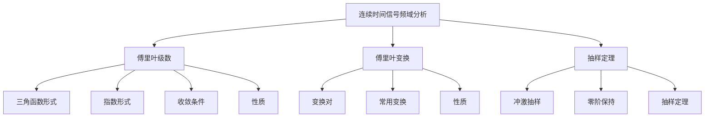
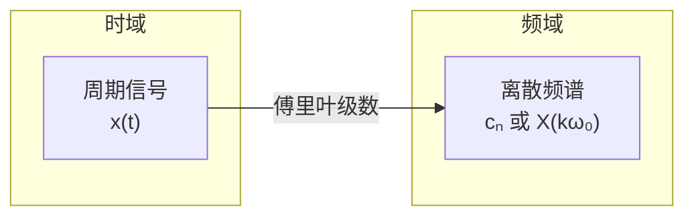
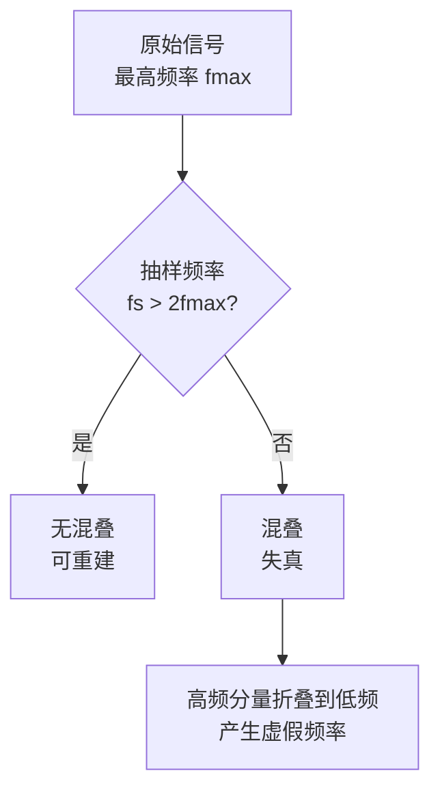

---

title: 信号与系统 L3 | 连续时间信号频域分析

draft: false

tags:

  - 信号与系统

  - 傅里叶分析

  - 频域

---

# 连续时间信号频域分析

> [!note] 本章概述
> 本章进入频域分析的核心——傅里叶变换。我们将看到，时间域和频率域只是同一信号的不同表示方式，它们之间存在深刻的数学联系。傅里叶变换是信号与系统分析最重要的工具之一。

## 章节脉络

---

## 3.1 连续时间周期信号的傅里叶级数

### 3.1.1 三角函数形式

对于周期为 $T_0$ 的连续时间周期信号 $x(t)$，可以展开为傅里叶级数：

$$x(t) = a_0 + \sum_{n=1}^{\infty} [a_n \cos(n\omega_0 t) + b_n \sin(n\omega_0 t)]$$

其中 $\omega_0 = \frac{2\pi}{T_0}$ 为基波频率。

**系数计算**：

- 直流分量：$a_0 = \frac{1}{T_0}\int_{T_0} x(t) dt$
- 余弦系数：$a_n = \frac{2}{T_0}\int_{T_0} x(t)\cos(n\omega_0 t) dt$
- 正弦系数：$b_n = \frac{2}{T_0}\int_{T_0} x(t)\sin(n\omega_0 t) dt$

> [!tip] 直观理解
> 傅里叶级数的本质是将一个复杂的周期信号分解为一系列简单的正弦和余弦信号的叠加。每个正弦分量就像一个"频率音符"，它们共同"合成"了原始信号的"旋律"。

### 3.1.2 指数形式

利用欧拉公式，傅里叶级数可以写成更简洁的指数形式：

$$x(t) = \sum_{n=-\infty}^{\infty} c_n e^{jn\omega_0 t}$$

其中系数：

$$c_n = \frac{1}{T_0}\int_{T_0} x(t) e^{-jn\omega_0 t} dt$$

> [!important] 指数形式的优美
> 指数形式用复数统一表示正频率和负频率，形式上更加简洁对称。在物理上，$c_n$ 和 $c_{-n}$ 共轭，代表同一频率的正弦和余弦分量。

### 3.1.3 收敛条件（Dirichlet 条件）

> [!caution] 并非所有周期信号都能展开
> 傅里叶级数收敛需要满足以下条件（Dirichlet 条件）：
> 1. 在任意周期内，$x(t)$ 绝对可积：$\int_{T_0} |x(t)| dt < \infty$
> 2. 在任意有限区间内，$x(t)$ 只有有限个极大值和极小值点
> 3. 在任意有限区间内，$x(t)$ 只有有限个第一类间断点

**实际意义**：工程中遇到的几乎所有周期信号都满足这些条件。

### 3.1.4 傅里叶级数的性质

| 性质              | 表达式                                                                                               |
| --------------- | ------------------------------------------------------------------------------------------------- |
| **线性性**         | 若 $x(t) \leftrightarrow c_n$，$y(t) \leftrightarrow d_n$，则 $ax(t)+by(t) \leftrightarrow ac_n+bd_n$ |
| **时移性**         | 若 $x(t) \leftrightarrow c_n$，则 $x(t-t_0) \leftrightarrow c_n e^{-jn\omega_0 t_0}$                 |
| **对称性**         | 偶函数：只有余弦项；奇函数：只有正弦项                                                                               |
| **Parseval 定理** | $\frac{1}{T_0}\int_{T_0}x(t)^2 dt = \sum_{n=-\infty}^{\infty}{c_n}^2$（能量守恒）                       |

> [!info] Parseval 定理的意义
> 这个定理表明：信号在时域的总能量等于各频率分量能量之和。它是"能量守恒"在频域的体现，也是功率谱密度理论的基础。

---

## 3.2 连续时间非周期信号的傅里叶变换

### 3.2.1 变换对

对于非周期信号 $x(t)$，其傅里叶变换定义为：

$$X(j\omega) = \int_{-\infty}^{\infty} x(t) e^{-j\omega t} dt$$

逆变换：

$$x(t) = \frac{1}{2\pi}\int_{-\infty}^{\infty} X(j\omega) e^{j\omega t} d\omega$$

> [!important] 从级数到变换
> 周期信号的傅里叶级数是离散的频谱（谐波），而非周期信号的傅里叶变换是连续的频谱。当周期信号的周期趋于无穷大时，离散频谱就变成了连续频谱——这就是傅里叶级数到傅里叶变换的过渡。

### 3.2.2 常用变换对

| 信号                 | 傅里叶变换                                                    |
| ------------------ | -------------------------------------------------------- |
| 矩形脉冲 $\Pi(t/T)$    | $T \text{sinc}(\omega T/2)$                              |
| 单位冲激 $\delta(t)$   | $1$                                                      |
| 常数 $1$             | $2\pi\delta(\omega)$                                     |
| $\text{sgn}(t)$    | $\frac{2}{j\omega}$                                      |
| 单位阶跃 $u(t)$        | $\pi\delta(\omega) + \frac{1}{j\omega}$                  |
| $e^{-at}u(t), a>0$ | $\frac{1}{a+j\omega}$                                    |
| $e^{j\omega_0 t}$  | $2\pi\delta(\omega - \omega_0)$                          |
| $\cos(\omega_0 t)$ | $\pi[\delta(\omega-\omega_0) + \delta(\omega+\omega_0)]$ |

> [!tip] 记忆技巧
> 记住几个基本变换：矩形脉冲 $\leftrightarrow$ sinc 函数，冲激 $\leftrightarrow$ 常数，常数 $\leftrightarrow$ 冲激。这些基本对可以推导出其他变换。

### 3.2.3 傅里叶变换的性质

| 性质       | 时域                                | 频域                                                     |
| -------- | --------------------------------- | ------------------------------------------------------ |
| **线性**   | $ax(t)+by(t)$                     | $aX(j\omega)+bY(j\omega)$                              |
| **时移**   | $x(t-t_0)$                        | $X(j\omega)e^{-j\omega t_0}$                           |
| **频移**   | $x(t)e^{j\omega_0 t}$             | $X(j(\omega-\omega_0))$                                |
| **尺度变换** | $x(at)$                           | $\frac{1}{a}X(j\omega/a)$                              |
| **时域微分** | $\frac{d^n x(t)}{dt^n}$           | $(j\omega)^n X(j\omega)$                               |
| **时域积分** | $\int_{-\infty}^{t} x(\tau)d\tau$ | $\frac{1}{j\omega}X(j\omega) + \pi X(0)\delta(\omega)$ |
| **时域卷积** | $x(t) * h(t)$                     | $X(j\omega)H(j\omega)$                                 |
| **频域卷积** | $x(t) \cdot y(t)$                 | $\frac{1}{2\pi}X(j\omega) * Y(j\omega)$                |

> [!important] 卷积定理——频域分析的核心
> 卷积定理告诉我们：**时域的卷积等于频域的乘法**。这是滤波器的理论基础——设计一个系统（在频域表现为 $H(j\omega)$），就等于设计一个频率响应。

---

## 3.3 周期和非周期信号的频谱分布

### 3.3.1 周期信号的频谱

周期信号的频谱是**离散**的（线状谱），只在基波频率的整数倍处存在分量。

**频谱的特点**：
- **谐波性**：各分量频率都是基波频率的整数倍
- **幅度衰减**：一般随谐波次数增加而衰减
- **对称性**：若 $x(t)$ 为实信号，则幅度谱偶对称，相位谱奇对称

### 3.3.2 非周期信号的频谱

非周期信号的频谱是**连续**的（连续谱）。

**与周期信号的关系**：
$$c_n = \frac{1}{T_0}X(j\omega)\Big|_{\omega=n\omega_0}$$

即周期信号的傅里叶级数系数，正比于对应非周期信号傅里叶变换在谐波频率点的采样值。

### 3.3.3 典型信号的频谱

> [!example] 矩形脉冲的频谱
> 矩形脉冲 $\Pi(t/T)$（宽度为 $T$）的频谱是抽样函数 $\text{sinc}(\omega T/2)$：
> - 主瓣宽度：$\Delta \omega = \frac{4\pi}{T}$
> - 旁瓣幅度随频率增加而衰减
> - **重要结论**：脉冲越窄，频谱越宽（时间-频率的固有矛盾）

> [!tip] 时间-频率不确定性原理
> 信号不可能在时域和频域同时任意窄。脉冲宽度 $T$ 与主瓣带宽 $\Delta f \approx 1/T$ 成反比。这是信号处理中的基本限制。

---

## 3.4 抽样定理

### 3.4.1 冲激抽样

用周期冲激串 $p(t) = \sum_{n=-\infty}^{\infty} \delta(t-nT_s)$ 对连续信号 $x(t)$ 抽样：

$$x_p(t) = x(t) \cdot p(t) = \sum_{n=-\infty}^{\infty} x(nT_s)\delta(t-nT_s)$$

抽样后信号的频谱：

$$X_p(j\omega) = \frac{1}{2\pi} X(j\omega) * P(j\omega) = \frac{1}{T_s}\sum_{k=-\infty}^{\infty} X(j(\omega - k\omega_s))$$

其中 $\omega_s = \frac{2\pi}{T_s}$ 为抽样频率。

### 3.4.2 零阶保持抽样

实际中常用零阶保持（Zero-Order Hold, ZOH）抽样：每个抽样值保持一个抽样周期。

零阶保持的频率响应：
$$H_{ZOH}(j\omega) = T_s \cdot \text{sinc}\left(\frac{\omega T_s}{2}\right) e^{-j\omega T_s/2}$$

> [!info] 实际考虑
> 零阶保持相当于一个低通滤波器，会引入一定的频率失真。在后续处理中通常需要补偿这个效应。

### 3.4.3 抽样定理

> [!important] 抽样定理（奈奎斯特-香农定理）
> 若连续信号 $x(t)$ 是带限信号（最高频率为 $f_{max}$），且抽样频率 $f_s$ 满足：
> $$f_s > 2f_{max}$$
> 则可以从抽样信号 $x(nT_s)$ 无失真地恢复原始信号 $x(t)$。

**重建公式**：
$$x(t) = \sum_{n=-\infty}^{\infty} x(nT_s) \cdot \text{sinc}\left(\frac{t-nT_s}{T_s}\right)$$

### 3.4.4 混叠现象

当 $f_s < 2f_{max}$ 时，抽样后频谱会发生重叠，导致**混叠**，无法无失真恢复原始信号。

> [!caution] 混叠的直观理解
> 想象车轮转动：当车轮转速（真实频率）超过采样帧率的一半时，看起来车轮会"倒转"。这就是频域的"折叠"现象。

> [!tip] 实际应用中的抽样
> - 音频 CD：抽样频率 44.1 kHz（人耳听觉上限约 20 kHz）
> - 电话语音：抽样频率 8 kHz（语音带宽约 4 kHz）
> - 视频：每帧作为空间抽样，时间上至少 24 fps

---

## 本章小结

> [!summary]
> 1. **傅里叶级数**：将周期信号分解为一系列离散频率分量（谐波）的叠加
> 2. **傅里叶变换**：将非周期信号表示为连续频率谱，是频域分析的核心工具
> 3. **卷积定理**：时域卷积等于频域乘法，是LTI系统分析的基础
> 4. **抽样定理**：$f_s > 2f_{max}$ 是无失真重建的条件，揭示了时间与频率的固有矛盾

---

## 思考题

1. **判断题**：如果一个信号是带限的，那么它的傅里叶变换在某个频率之外为零。

   > [!answer]
   > **答案：正确**。这是带限信号的定义。

2. **问答题**：解释为什么傅里叶级数的系数 $c_n$ 和 $c_{-n}$ 共轭？

   > [!answer]
   > **答案要点**：因为 $x(t)$ 是实信号，其傅里叶级数满足 $c_{-n} = c_n^*$。这反映了频谱的共轭对称性：正频率和负频率分量成对出现，共同构成实信号的时域波形。

3. **选择题**：一个带宽为 10 kHz 的信号，所需的最小抽样频率是多少？
   - A. 10 kHz
   - B. 20 kHz
   - C. 25 kHz
   - D. 40 kHz

   > [!answer]
   > **答案：B**。根据抽样定理，$f_s > 2f_{max} = 20$ kHz，最小为 20 kHz。

---

## 发散拓展

### 傅里叶变换的实际应用

1. **音频处理**
   - 频谱分析：使用 FFT（快速傅里叶变换）分析音频信号的频率成分
   - 均衡器：调整不同频段的增益
   - 降噪：识别并削弱特定频率的噪声
   - [音频处理基础](https://www.audacityteam.org/)

2. **图像处理**
   - 二维傅里叶变换：分析图像的频率特征
   - 图像滤波：低通/高通滤波去除噪声或增强边缘
   - JPEG 压缩：利用 DCT（离散余弦变换，类似 FFT）
   - [数字图像处理教程](https://www.imageprocessingplace.com/)

3. **通信系统**
   - 调制：将信息信号加载到高频载波上
   - 信道均衡：补偿信道的频率选择性失真
   - OFDM：正交频分复用，利用傅里叶变换实现
   - [通信系统原理](https://www.gaussianwaves.com/)

4. **振动分析**
   - 机械故障诊断：通过频谱识别异常振动模式
   - 建筑结构监测：检测共振频率
   - [MATLAB 振动分析](https://www.mathworks.com/videos/series/understanding-vibration-analysis-100815.html)

> [!info] 延伸学习
> - 深入学习：参考 Oppenheim & Willsky《信号与系统》第 4-7 章
> - 后续内容：[[信号与系统 L4 | 连续时间系统频域分析]] 将讨论如何在频域中分析 LTI 系统
> - 实践工具：学习 MATLAB 的 `fft()` 函数和 Python 的 `numpy.fft` 模块
