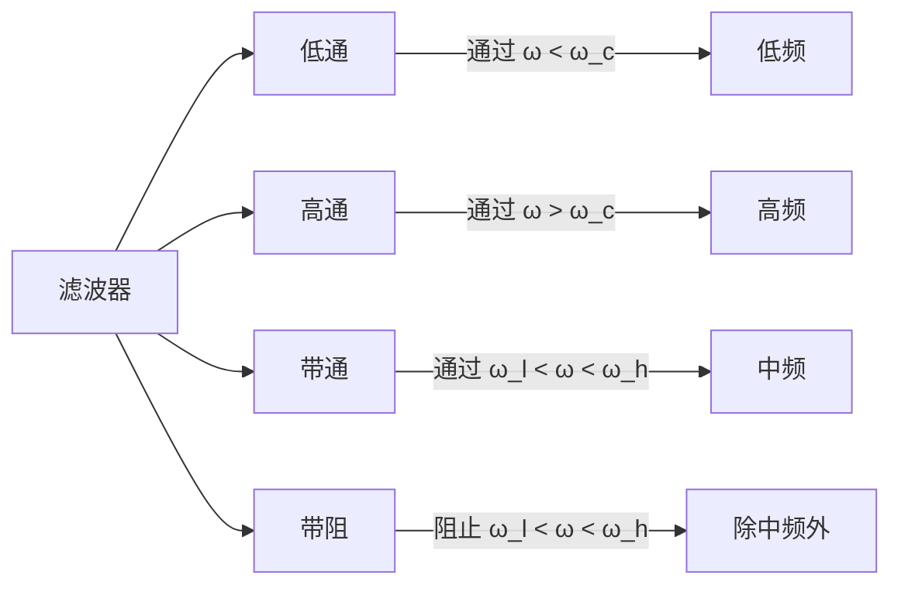

---

title: 信号与系统 L4 | 连续时间系统频域分析

draft: false

tags:

  - 信号与系统

  - 系统分析

  - 频域

---

# 连续时间系统频域分析

> [!note] 本章概述
> 本章将频域分析应用于LTI系统。我们将学习如何用频率响应描述系统，如何设计滤波器实现信号的频域处理，以及无失真传输的条件。

## 章节脉络

```mermaid
flowchart TD
    A[连续时间系统频域分析] --> B[系统函数与频率响应]
    A --> C[系统的频域分析]
    A --> D[无失真传输]
    A --> E[理想滤波器]
    A --> F[佩利-维纳准则]

    B --> B1[H(jω) = Y(jω)/X(jω)]
    B --> B2[幅频特性与相频特性]

    C --> C1[滤波器的分类]
    C --> C2[低通/高通/带通/带阻]

    D --> D1[幅度条件]
    D --> D2[相位条件]

    E --> E1[理想低通]
    E --> E2[其他理想滤波器]
    E --> E3[可实现性问题

    F --> F1[必要条件]
    F --> F2[充分条件]
```

---

## 4.1 系统函数与频率响应

### 4.1.1 系统函数的定义

对于 LTI 系统，其**系统函数**（或**频率响应**）定义为输出与输入的傅里叶变换之比：

$$H(j\omega) = \frac{Y(j\omega)}{X(j\omega)}$$

其中：
- $X(j\omega)$：输入信号的傅里叶变换
- $Y(j\omega)$：输出信号的傅里叶变换
- $H(j\omega)$：系统的频率响应

> [!important] 系统函数的重要性
> $H(j\omega)$ 完全描述了 LTI 系统的频率特性。一旦知道 $H(j\omega)$，就可以求出系统对任意输入的响应：
> $$Y(j\omega) = X(j\omega) \cdot H(j\omega)$$

### 4.1.2 频率响应的表示

频率响应 $H(j\omega)$ 是一个复数，可以表示为：

$$H(j\omega) = |H(j\omega)| e^{j\varphi(\omega)}$$

| 特性 | 描述 | 物理意义 |
|------|------|----------|
| **幅频特性** $|H(j\omega)|$ | 幅度随频率的变化 | 系统对不同频率信号的增益 |
| **相频特性** $\varphi(\omega)$ | 相位随频率的变化 | 系统对不同频率信号的延迟 |

> [!tip] 直观理解
> 幅频特性告诉我们"系统喜欢哪些频率"——像筛子一样选择性地放大或衰减某些频率。相频特性告诉我们"系统如何延迟不同频率"——影响信号的波形。

---

## 4.2 系统的频域分析——滤波

### 4.2.1 滤波器的概念

**滤波器**是一种选择性地通过或抑制信号某些频率成分的系统。

$$Y(j\omega) = X(j\omega) \cdot H(j\omega)$$

通过设计 $H(j\omega)$ 的形状，可以实现对信号频谱的操控。

### 4.2.2 滤波器的分类



| 类型 | 幅频特性 | 作用 |
|------|----------|------|
| **低通滤波器 (LPF)** | 通过 $\omega < \omega_c$，阻止 $\omega > \omega_c$ | 去除高频噪声，平滑信号 |
| **高通滤波器 (HPF)** | 通过 $\omega > \omega_c$，阻止 $\omega < \omega_c$ | 去除直流分量，提取边缘 |
| **带通滤波器 (BPF)** | 通过 $\omega_l < \omega < \omega_h$ | 选择特定频段 |
| **带阻滤波器 (BSF)** | 阻止 $\omega_l < \omega < \omega_h$ | 去除特定干扰 |

> [!example] 滤波器的实际应用
> - **低通**：数码相机去摩尔纹，手机拍照降噪
> - **高通**：高通滤波器去除 ECG 信号中的基线漂移
> - **带通**：收音机选台，语音识别

---

## 4.3 无失真传输

### 4.3.1 无失真传输的条件

**无失真传输**指输出信号与输入信号只有幅度缩放和时间延迟，波形完全相同：

$$y(t) = K \cdot x(t - t_d)$$

其中 $K$ 是增益，$t_d$ 是延迟时间。

> [!important] 无失真传输的频率条件
> 对上式进行傅里叶变换：
> $$Y(j\omega) = K e^{-j\omega t_d} X(j\omega)$$
> 因此无失真传输需要满足：
> - **幅度条件**：$|H(j\omega)| = K$（常数，与 $\omega$ 无关）
> - **相位条件**：$\varphi(\omega) = -\omega t_d$（线性相位）

### 4.3.2 线性相位

**相位延迟**：$t_p(\omega) = -\frac{\varphi(\omega)}{\omega}$

**群延迟**：$t_g(\omega) = -\frac{d\varphi(\omega)}{d\omega}$

> [!info] 群延迟的意义
> 群延迟表示不同频率分量通过系统时的平均延迟。对于无失真传输，所有频率分量的群延迟应该相同（常数），这样信号波形才能保持不变。

> [!tip] 实际系统的相位失真
> 实际系统中，相位通常是非线性的，这会导致不同频率分量以不同速度传播，造成信号波形失真（如语音信号相位失真会影响可懂度）。

---

## 4.4 理想滤波器

### 4.4.1 理想低通滤波器

$$H(j\omega) = \begin{cases} 1, & |\omega| < \omega_c \\ 0, & |\omega| > \omega_c \end{cases}$$

- **通带**：$|\omega| < \omega_c$，$|H(j\omega)| = 1$
- **阻带**：$|\omega| > \omega_c$，$|H(j\omega)| = 0$
- **截止频率**：$\omega_c$

**冲激响应**（对 $H(j\omega)$ 求逆变换）：
$$h(t) = \frac{\omega_c}{\pi} \text{sinc}(\omega_c t)$$

> [!caution] 理想滤波器的不可实现性
> 理想滤波器是**物理不可实现的**，因为：
> 1. **非因果性**：$h(t)$ 在 $t < 0$ 时不为零
> 2. **无穷阶数**：需要无穷多个储能元件

### 4.4.2 其他理想滤波器

| 类型 | 频率响应 |
|------|----------|
| **理想高通** | $H(j\omega) = 1 - \Pi(\omega/2\omega_c)$ |
| **理想带通** | $H(j\omega) = \Pi((\omega-\omega_0)/B)$ |
| **理想带阻** | $H(j\omega) = 1 - \Pi(\omega/B)$ |

---

## 4.5 佩利-维纳准则（Paley-Winner Criterion）

> [!important] 因果系统可实现的必要条件
> 佩利-维纳准则给出了**因果可实现系统**的频率响应必须满足的条件：

$$\int_{-\infty}^{\infty} \frac{|\ln |H(j\omega)||}{1 + \omega^2} d\omega < \infty$$

**物理意义**：
- 幅频特性 $|H(j\omega)|$ 不能在有限频带内为零（否则对数无穷大，积分发散）
- 幅度特性不能过于"陡峭"地变化

**推论**：
- 理想滤波器（矩形幅频特性）在某些频带内为零，**必然不可实现**
- 实际滤波器的过渡带必须非零

> [!tip] 佩利-维纳准则的直观理解
> 这个准则告诉我们：因果性和可实现性是有"代价"的。任何实际可实现的滤波器都必须在幅度和相位之间做出权衡，不能同时获得理想的矩形幅频特性和线性相位。

---

## 4.6 线性系统的时域与频域特性

### 6.1 频域与时域的对应关系

| 频域特性 | 时域特性 |
|----------|----------|
| 矩形幅频（理想低通） | sinc 冲激响应（非因果） |
| 缓变的幅频 | 缓变的冲激响应 |
| 陡峭的幅频 | 长的冲激响应 |
| 线性相位 | 对称的冲激响应 |
| 非线性相位 | 不对称的冲激响应 |

> [!info] 设计与实现的权衡
> 设计滤波器时存在固有的权衡：
> - **幅度响应 vs 过渡带**：越陡峭的截止需要越长的冲激响应
> - **幅度响应 vs 相位响应**：最小相位系统可以在幅度和相位之间取得最佳平衡

### 6.2 典型实际滤波器

| 类型 | 特点 | 应用 |
|------|------|------|
| **巴特沃斯** | 通带最平坦，阶跃响应好 | 音频处理 |
| **切比雪夫** | 通带/阻带有纹波，过渡带最陡 | 通信系统 |
| **椭圆** | 通带阻带都有纹波，过渡带最陡 | 频分复用 |
| **贝塞尔** | 相位线性最好，阶跃响应无振荡 | 脉冲传输 |

> [!example] 实际滤波器设计
> MATLAB 中可以使用 `butter()`, `cheby1()`, `ellip()`, `besself()` 函数设计各种滤波器。

---

## 本章小结

> [!summary]
> 1. **系统函数**：$H(j\omega) = Y(j\omega)/X(j\omega)$ 完全描述了系统的频率特性
> 2. **滤波器**：通过设计 $H(j\omega)$ 选择性地处理信号的频率成分
> 3. **无失真传输**：需要 $|H(j\omega)| = K$ 和 $\varphi(\omega) = -\omega t_d$
> 4. **理想滤波器**：物理不可实现（因果性约束）
> 5. **佩利-维纳准则**：给出了因果可实现系统的必要条件
> 6. **设计权衡**：幅度响应、过渡带、相位特性之间需要权衡

---

## 思考题

1. **选择题**：下列哪种滤波器可以无失真地传输信号？
   - A. 理想低通滤波器
   - B. 幅频特性为常数、相位为线性的滤波器
   - C. 幅频特性为常数、相位为非线性的滤波器
   - D. 任意滤波器

   > [!answer]
   > **答案：B**。无失真传输需要幅度常数且相位线性（非线性相位会导致不同频率分量以不同速度传播，造成波形失真）。

2. **判断题**：理想低通滤波器是因果可实现的。

   > [!answer]
   > **答案：错误**。理想低通滤波器的冲激响应 $h(t) = \frac{\omega_c}{\pi} \text{sinc}(\omega_c t)$ 在 $t < 0$ 时不为零，违反因果性，且佩利-维纳准则表明其不可实现。

3. **问答题**：解释为什么实际滤波器的过渡带不能无限陡峭？

   > [!answer]
> **答案要点**：
> - 根据佩利-维纳准则，因果可实现系统的幅度不能急剧变化（不能为 0）
> - 过渡带越陡，对应的冲激响应越长，系统越复杂（更高阶）
> - 实际中需要在滤波效果和实现复杂度之间做权衡

---

## 发散拓展

### 滤波器与系统的实际应用

1. **通信系统**
   - 载波调制：将信息搬到高频以便传输
   - 信道选择：带通滤波器选择特定频段
   - 均衡器：补偿信道失真
   - [通信滤波器设计](https://www.keysight.com/)

2. **音频工程**
   - 均衡器：调整不同频段的音量
   - 降噪：低通滤波去除高频噪声
   - 房间声学：音箱分频器
   - [音频滤波器教程](https://www.audiohero.com/)

3. **图像处理**
   - 低通滤波：平滑去噪
   - 高通滤波：边缘增强
   - 带通滤波：纹理分析
   - [图像滤波技术](https://www.cs.cornell.edu/)

4. **生物医学**
   - ECG 滤波：去除工频干扰（50/60 Hz）
   - EEG 分析：提取特定频段的脑电活动
   - 助听器：自适应滤波降噪
   - [生物医学信号处理](https://www.biomed信号.com/)

> [!info] 延伸学习
> - 深入学习：参考 Oppenheim & Willsky《信号与系统》第 5-6 章
> - 实践工具：学习 MATLAB 的 `filter design` 工具箱
> - 后续内容：可以学习 [[信号与系统 L5 | 拉普拉斯变换]] 深入系统稳定性分析
