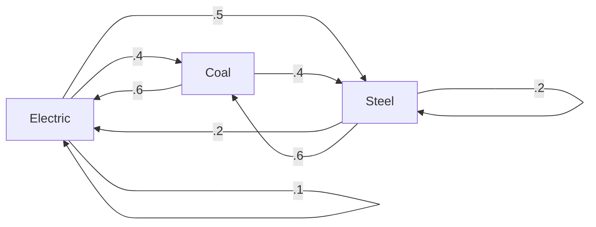

#### A Simple Economy

Imagine we have 3 kinds of resources in our society. The relationship among them can be presented as below. 



For clarity, we list a table below

**Distribution of Output from:**

| Coal | Electric | Steel | Purchased by |
| ---- | -------- | ----- | ------------ |
| .0   | .4       | .6    | Coal         |
| .6   | .1       | .2    | Electric     |
| .4   | .5       | .2    | Steel        |

Let's denote $\rm (Coal,Electric, Steel)$ as $(x,y,z)$, $(\Delta x,\Delta y,\Delta z)$ as a vector of the difference from previous vector after distribution.

$$
\begin{cases}
\Delta x = .0x+.4y+.6z - x \\[2ex]
\Delta y = .6x+.1y+.2z - y\\[2ex]
\Delta z = .4x+.5y+.2z - z \\[2ex]
\end{cases}
$$

> [!faq] Let me ask...
> Is it possible to make $(\Delta x,\Delta y,\Delta z)=\boldsymbol 0$ ?
> > [!hint] Equilibrium prices
> > The income of each sector exactly balances its expenses.
> > 
> > Here, we mean $(\Delta x,\Delta y, \Delta z) = (0,0,0)$

We observe and find out that the problem can be boiled down to solving a equations system.

Furthermore, we can see that it's a homogenous linear equation system.

> [!note]
> $$
> A = \begin{bmatrix}
> -1 & .4 & .6 \\
> .6 & -.9 & .2 \\
> .4 & .5 & -.8\\ 
> \end{bmatrix},
> {\boldsymbol x} = \begin{bmatrix}
> x \\
> y \\
> z \\
> \end{bmatrix}
> ,
> {\boldsymbol b = \boldsymbol 0}
> $$
> 
> Solve
> $$
> A\boldsymbol x = \boldsymbol 0
> $$
> 

We do it with MATLAB

```matlab
rref(A)
```

and we'll get

```
1.0000         0   -0.9394
	 0    1.0000   -0.8485
	 0         0         0
```

So the answer can be 

$$
\boldsymbol p = 
\begin{bmatrix}
.94 \\
.85\\
1
\end{bmatrix}z
$$

> [!hint] Conclusion
> If we put 94$ into coal, 85$ into electric and 100$ into steel, then the values of these resources will not change.


#### The Leontief Input-Output Model


